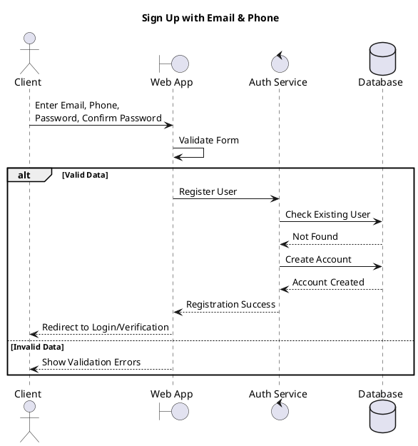
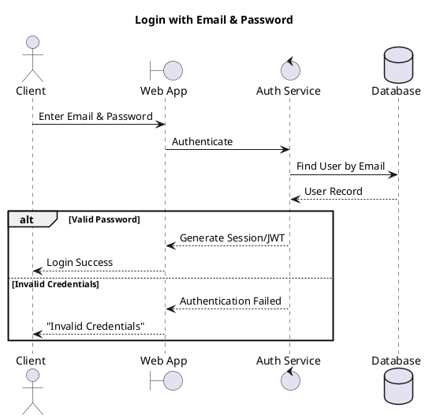
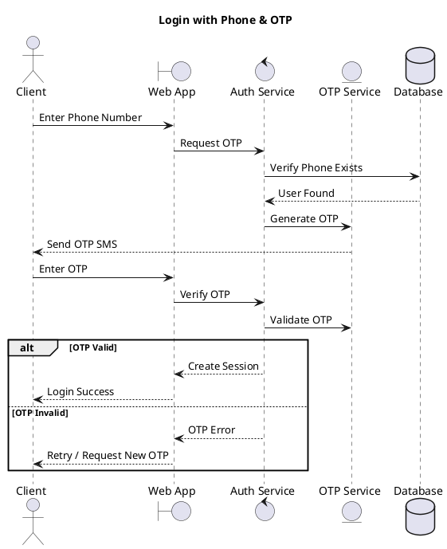
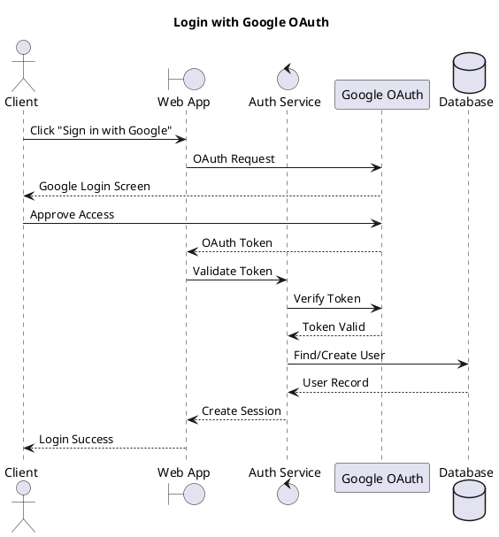
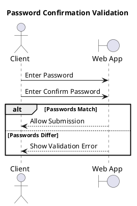
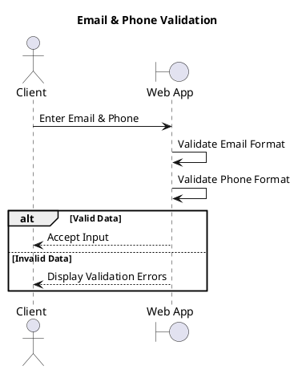
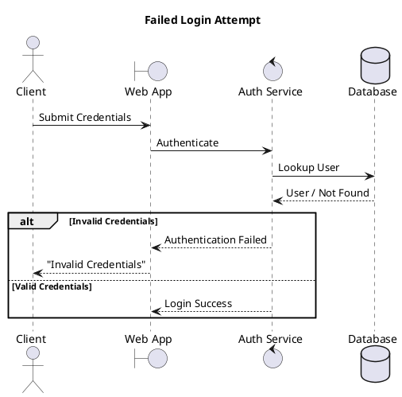
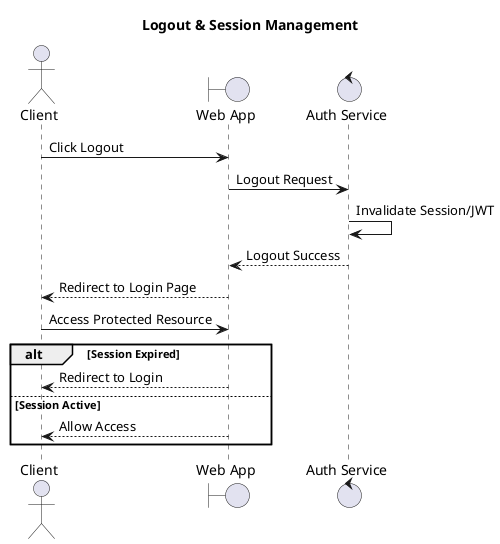
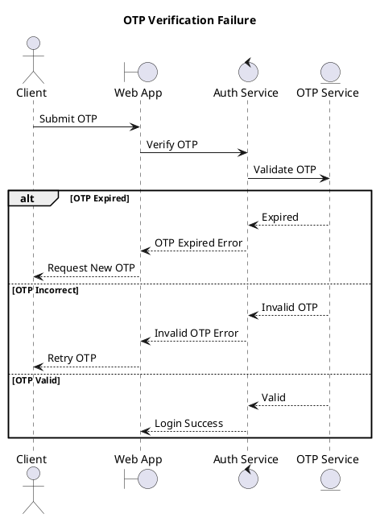

## Story Description
**As a** Client  
**I want to** access a secure authentication system including Sign Up, Login, and Logout features  
**So that** I can create an account, securely access my data, and manage my session.

## Acceptance Criteria
- [ ] **Scenario 1: Sign Up with Email and Phone**
    - **Given** I am a new client on the registration page
    - **When** I fill in Email Address, Phone Number, Password, and Confirm Password and submit the form
    - **Then** the system should create my account and redirect me to the next step (e.g., verification or login).
- [ ] **Scenario 2: Login with Email and Password**
    - **Given** I have a registered account with an email and password
    - **When** I enter my Email and Password on the login page
    - **Then** I should be successfully authenticated and granted access to the website.
- [ ] **Scenario 3: Login with Phone and OTP**
    - **Given** I have a registered account with a phone number
    - **When** I enter my Phone Number and request an OTP, then enter the received valid OTP
    - **Then** I should be successfully authenticated and logged in.
- [ ] **Scenario 4: Login with Google Account**
    - **Given** I have a Google account
    - **When** I choose to "Sign in with Google" and complete the Google OAuth process
    - **Then** the system should authenticate me and log me into the website.
- [ ] **Scenario 5: Password Confirmation Validation**
    - **Given** I am on the registration page
    - **When** I enter a password in the "Password" field and a different one in "Confirm Password"
    - **Then** the system should display a validation error and prevent form submission.
- [ ] **Scenario 6: Data Validation (Email & Phone)**
    - **Given** I am on the sign-up/login page
    - **When** I enter an invalid email format or an invalid phone number
    - **Then** the system must validate the fields and display appropriate error messages.
- [ ] **Scenario 7: Failed Login Attempts**
    - **Given** I am on the login page
    - **When** I enter incorrect credentials (wrong password or unregistered email/phone)
    - **Then** the system should display a "Invalid credentials" error message and deny access.
- [ ] **Scenario 8: Logout & Session Management**
    - **Given** I am a logged-in client
    - **When** I select the Logout option
    - **Then** my active session should be terminated, and I should be redirected to the login page, unable to access restricted areas without re-authenticating.
- [ ] **Scenario 9: OTP Verification Failure**
    - **Given** I have requested an OTP for phone login
    - **When** I enter an expired or incorrect OTP
    - **Then** the system should display an error message and allow me to retry or request a new OTP.

# 1. Sign Up with Email & Phone

# 2. Login with Email & Password

# 3. Login with Phone & OTP

# 4. Login with Google OAuth

# 5. Password Confirmation Validation

# 6. Email & Phone Validation

# 7. Failed Login Attempt

# 8. Logout & Session Management

# 9. OTP Verification Failure

