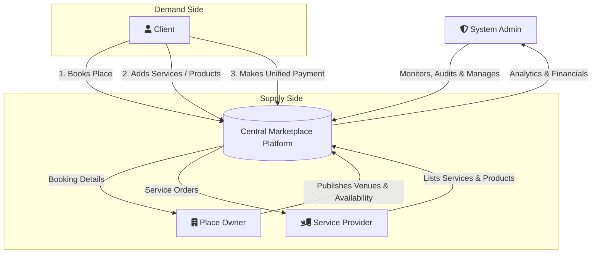
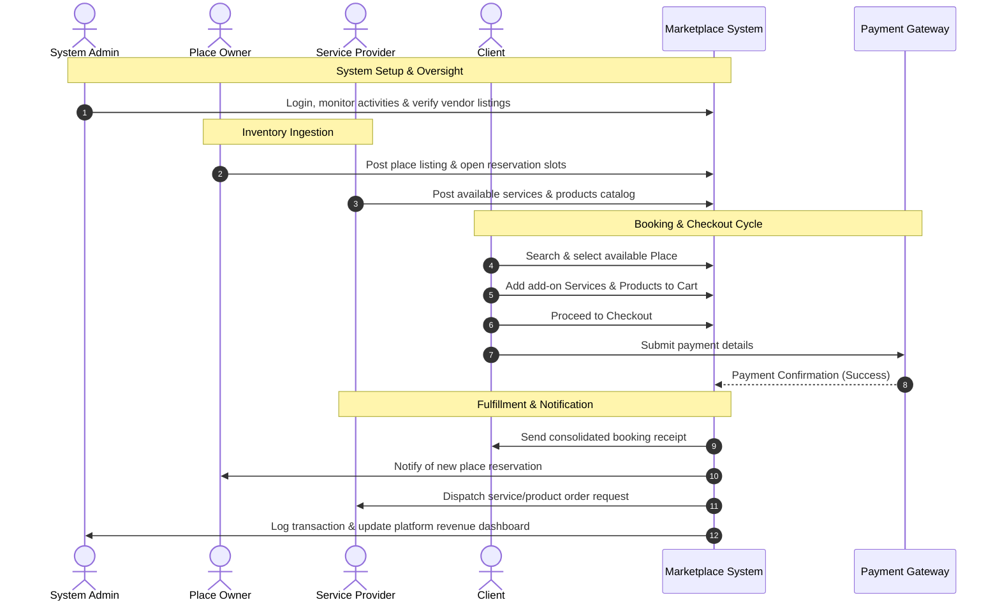

This system is a **Multi-Sided Marketplace Platform for Venue Booking & Event Services**. It functions as an ecosystem connecting event organizers/customers with space owners and service/product vendors, all governed and audited by a centralized System Administrator.

  

# 1. System Vision & Core Value Proposition

The platform simplifies event and space booking by creating a single unified checkout experience:

- **The Problem:** Booking a venue and gathering all necessary services/products (catering, decor, equipment, photographers) traditionally requires negotiating with multiple disconnected vendors.
      
- **The Solution:** A client can discover a venue, book the required time slot, bundle associated services and add-on products from third-party vendors into a single cart, and complete payment in **==one==** transaction.
    

# 2. Stakeholders & Role Matrix

| **Stakeholder / Actor** | **Primary Responsibility** | **Key Platform Capabilities**                                                                                                                                                                                                                                                                           |
| ----------------------- | -------------------------- | ------------------------------------------------------------------------------------------------------------------------------------------------------------------------------------------------------------------------------------------------------------------------------------------------------- |
| **Client (Customer)**   | Demand / Consumer          | • Search & discover available places.    • Select time slots/dates for reservations.  • Browse vendor services and product catalogs.  • Unified Cart management (Place + Services + Products).  • Checkout and payment confirmation.  • Track reservation & order status. |
| **Place Owner**         | Supply (Venues)            | • Create & manage venue listings (location, capacity, photos, amenities).    • Configure availability schedules & pricing rules.  • Accept/manage place reservations.  • View venue booking performance.                                                                              |
| **Service Provider**    | Supply (Services & Goods)  | • Manage provider profile & service categories.  • Post service packages (e.g., catering, photography) & products.  • Set pricing, lead times, and capacity.  • Receive, fulfill, and update service/product orders.                                                                  |
| **System Admin**        | Governance & Monitoring    | • Full system monitoring & audit tracking.    • Approve/verify new place listings & service providers.  • Track transactions, commissions, refunds, and payouts.  • System-wide user & dispute management.                                                                            |

# 3. High-Level Architecture & Interaction Overview

Code snippet

# 4. End-to-End Operational Workflow

Code snippet

#  5. Core Architectural Modules

**1. User On-boarding, Verification & Governance Engine**

* **Dynamic Role Registration:** Supports on-boarding flows tailored to Clients, Place Owners, and Service Providers.
* **Admin KYC & Approval Gate:** Enforces administrative review pipelines where incoming Place Owners and Service Providers remain pending (`is_approved: false`) until identity, business licensing, and service legitimacy are verified and approved by an Admin.
* **Account Lifecycle Management:** Centralized Admin controls to monitor, suspend, activate, or audit all platform users across the ecosystem.

**2. Inventory, Booking & Service Catalog Engine**

* **Venue Reservation Engine محرك حجز الأماكن:** Handles real-time calendar scheduling, time-slot allocation, conflicts, capacity controls, and booking policies for Place Owners.
* **Service & Product Catalog:** Manages SKU-level catalogs, customizable package configurations, ~~dynamic~~ pricing, and lead-time constraints for Service Providers.

**3. Unified Cart & Order Orchestration Pipeline**

* **Composite Order Processing:** Bundles venue reservations, third-party services, and add-on products into a **single** atomic transaction.
* **End-to-End Tracking Hub:** Real-time visibility across all operational stages for Clients, Owners, and Providers, with a dedicated Admin oversight console to monitor global reservation states, order fulfillment, and dispute escalations تصعيد النزاعات.

**4. Financial Settlement, Escrow & Payment Engine**

* **Unified Client Checkout:** Secure payment gateway integration processing upfront payments for combined bookings.
* **Cancellation & Automated Refund Pipeline:** Admin-governed policy engine that manages reservation/order cancellations and triggers ~~automated or~~  manual money-back refunds directly to clients.
* **Post-Fulfillment Vendor Payouts:** ~~Automated~~ payout disbursements transferring verified net revenues to Place Owners and Service Providers' bank accounts once orders and bookings are officially confirmed and fulfilled.