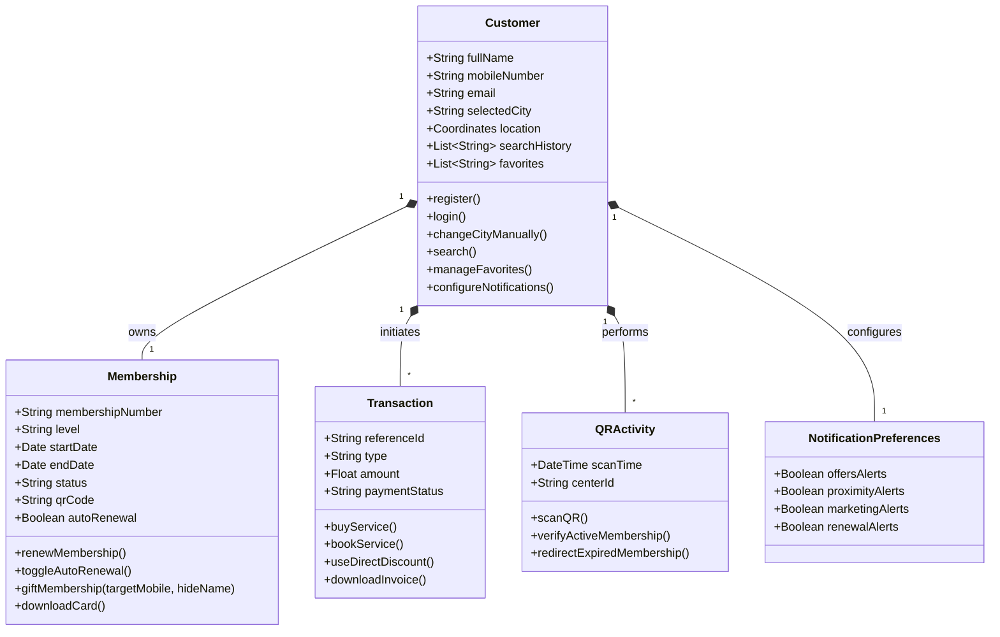

```mermaid
classDiagram
    class Customer {
        +String fullName
        +String mobileNumber
        +String email
        +String selectedCity
        +Coordinates location
        +List~String~ searchHistory
        +List~String~ favorites
        +register()
        +login()
        +changeCityManually()
        +search()
        +manageFavorites()
        +configureNotifications()
    }

    class Membership {
        +String membershipNumber
        +String level
        +Date startDate
        +Date endDate
        +String status
        +String qrCode
        +Boolean autoRenewal
        +renewMembership()
        +toggleAutoRenewal()
        +giftMembership(targetMobile, hideName)
        +downloadCard()
    }

    class Transaction {
        +String referenceId
        +String type
        +Float amount
        +String paymentStatus
        +buyService()
        +bookService()
        +useDirectDiscount()
        +downloadInvoice()
    }

    class QRActivity {
        +DateTime scanTime
        +String centerId
        +scanQR()
        +verifyActiveMembership()
        +redirectExpiredMembership()
    }

    class NotificationPreferences {
        +Boolean offersAlerts
        +Boolean proximityAlerts
        +Boolean marketingAlerts
        +Boolean renewalAlerts
    }

    Customer "1" *-- "1" Membership : owns
    Customer "1" *-- "*" Transaction : initiates
    Customer "1" *-- "*" QRActivity : performs
    Customer "1" *-- "1" NotificationPreferences : configures
```