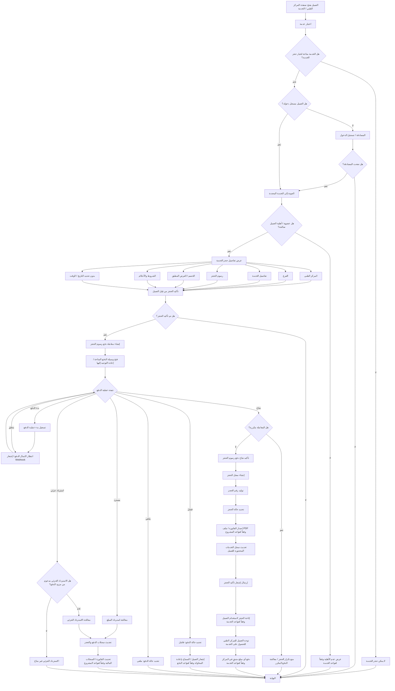

```mermaid
flowchart TD
    A[العميل يفتح صفحة المركز الطبي / الخدمة] --> B[اختيار خدمة]
    B --> C{هل الخدمة متاحة لخيار حجز الخدمة؟}

    C -->|لا| D[لا يمكن حجز الخدمة]
    D --> Z[النهاية]

    C -->|نعم| E{هل العميل مسجل دخوله؟}

    E -->|لا| F[المصادقة / تسجيل الدخول]
    F --> G{هل نجحت المصادقة؟}
    G -->|لا| Z
    G -->|نعم| H[العودة إلى الخدمة المحددة]

    E -->|نعم| H

    H --> I{هل عضوية / أهلية العميل صالحة؟}

    I -->|لا| J[عرض عدم الأهلية وفقاً لقواعد الخدمة]
    J --> Z

    I -->|نعم| K[عرض تفاصيل حجز الخدمة]

    K --> L[المركز الطبي]
    K --> M[الفرع]
    K --> N[تفاصيل الخدمة]
    K --> O[رسوم الحجز]
    K --> P[الخصم / العرض المطبق]
    K --> Q[الشروط والأحكام]

    L --> R[تأكيد الحجز من قِبل العميل]
    M --> R
    N --> R
    O --> R
    P --> R
    Q --> R

    R --> S{هل تم تأكيد الحجز؟}

    S -->|لا| Z

    S -->|نعم| T[إنشاء معاملة دفع رسوم الحجز]
    T --> U[فتح وسيلة الدفع المتاحة / إعادة التوجيه إليها]

    U --> V{نتيجة عملية الدفع}

    V -->|بدء الدفع| W[تسجيل بدء عملية الدفع]
    W --> X[انتظار اكتمال الدفع / إشعار Webhook]
    X --> V

    V -->|معلق| X

    V -->|نجاح| Y{هل المعاملة مكررة؟}

    Y -->|نعم| Y1[منع تكرار الحجز / معالجة الدفع المكرر]
    Y1 --> Z

    Y -->|لا| AA[تأكيد نجاح دفع رسوم الحجز]
    AA --> AB[إنشاء سجل الحجز]
    AB --> AC[توليد رقم الحجز]
    AC --> AD[تحديد حالة الحجز]
    AD --> AE[إصدار الفاتورة / ملف PDF وفقاً لقواعد المشروع]
    AE --> AF[تحديث سجل الخدمات المحجوزة للعميل]
    AF --> AG[إرسال إشعار تأكيد الحجز]
    AG --> AH[إتاحة الحجز لاستخدام العميل وفقاً لقواعد الخدمة]
    AH --> AI[توجه العميل للمركز الطبي للحصول على الخدمة]
    AI --> AJ[دفع أي مبلغ متبقٍ في المركز وفقاً لقواعد الخدمة]
    AJ --> Z

    V -->|فشل| AK[تحديد حالة الدفع: فاشل]
    AK --> AL[إشعار العميل / السماح بإعادة المحاولة وفقاً لقواعد الدفع]
    AL --> Z

    V -->|ملغي| AM[تحديد حالة الدفع: ملغي]
    AM --> Z

    V -->|مسترد| AN[معالجة استرداد المبلغ]
    AN --> AO[تحديث سجلات الدفع والحجز]
    AO --> AP[تحديث الفاتورة / السجلات المالية وفقاً لقواعد المشروع]
    AP --> Z

    V -->|استرداد جزئي| AQ{هل الاسترداد الجزئي مدعوم من مزود الدفع؟}

    AQ -->|نعم| AR[معالجة الاسترداد الجزئي]
    AR --> AO

    AQ -->|لا| AS[الاسترداد الجزئي غير متاح]
    AS --> Z

    %% قيد الحجز الصريح
    K --> AT[بدون تحديد التاريخ / الوقت]
    AT --> R
```
