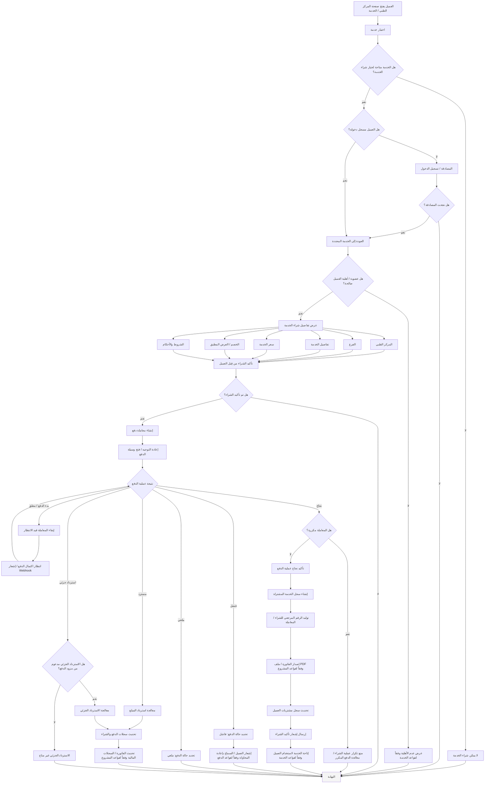

## Path 1: Service Not Available for Purchase
فتح صفحة المركز الطبي/الخدمة ⬅ اختيار خدمة ⬅ هل الخدمة متاحة لخيار شراء الخدمة؟ ⬅ لا ⬅ لا يمكن شراء الخدمة ⬅ النهاية

---

## Path 2: Customer Not Logged In - Authentication Failed
فتح صفحة المركز الطبي/الخدمة ⬅ اختيار خدمة ⬅ هل الخدمة متاحة لخيار شراء الخدمة؟ ⬅ نعم ⬅ هل العميل مسجل دخوله؟ ⬅ لا ⬅ المصادقة / تسجيل الدخول ⬅ هل نجحت المصادقة؟ ⬅ لا ⬅ النهاية

---

## Path 3: Customer Not Logged In - Authentication Success - Membership Invalid
فتح صفحة المركز الطبي/الخدمة ⬅ اختيار خدمة ⬅ هل الخدمة متاحة لخيار شراء الخدمة؟ ⬅ نعم ⬅ هل العميل مسجل دخوله؟ ⬅ لا ⬅ المصادقة / تسجيل الدخول ⬅ هل نجحت المصادقة؟ ⬅ نعم ⬅ العودة إلى الخدمة المحددة ⬅ هل عضوية / أهلية العميل صالحة؟ ⬅ لا ⬅ عرض عدم الأهلية وفقاً لقواعد الخدمة ⬅ النهاية

---

## Path 4: Customer Not Logged In - Authentication Success - Membership Valid - Purchase Not Confirmed
فتح صفحة المركز الطبي/الخدمة ⬅ اختيار خدمة ⬅ هل الخدمة متاحة لخيار شراء الخدمة؟ ⬅ نعم ⬅ هل العميل مسجل دخوله؟ ⬅ لا ⬅ المصادقة / تسجيل الدخول ⬅ هل نجحت المصادقة؟ ⬅ نعم ⬅ العودة إلى الخدمة المحددة ⬅ هل عضوية / أهلية العميل صالحة؟ ⬅ نعم ⬅ عرض تفاصيل شراء الخدمة ⬅ المركز الطبي، الفرع، تفاصيل الخدمة، سعر الخدمة، الخصم/العرض المطبق، الشروط والأحكام ⬅ تأكيد الشراء من قِبل العميل ⬅ هل تم تأكيد الشراء؟ ⬅ لا ⬅ النهاية

---

## Path 5: Customer Logged In - Membership Invalid
فتح صفحة المركز الطبي/الخدمة ⬅ اختيار خدمة ⬅ هل الخدمة متاحة لخيار شراء الخدمة؟ ⬅ نعم ⬅ هل العميل مسجل دخوله؟ ⬅ نعم ⬅ العودة إلى الخدمة المحددة ⬅ هل عضوية / أهلية العميل صالحة؟ ⬅ لا ⬅ عرض عدم الأهلية وفقاً لقواعد الخدمة ⬅ النهاية

---

## Path 6: Customer Logged In - Membership Valid - Purchase Not Confirmed
فتح صفحة المركز الطبي/الخدمة ⬅ اختيار خدمة ⬅ هل الخدمة متاحة لخيار شراء الخدمة؟ ⬅ نعم ⬅ هل العميل مسجل دخوله؟ ⬅ نعم ⬅ العودة إلى الخدمة المحددة ⬅ هل عضوية / أهلية العميل صالحة؟ ⬅ نعم ⬅ عرض تفاصيل شراء الخدمة ⬅ المركز الطبي، الفرع، تفاصيل الخدمة، سعر الخدمة، الخصم/العرض المطبق، الشروط والأحكام ⬅ تأكيد الشراء من قِبل العميل ⬅ هل تم تأكيد الشراء؟ ⬅ لا ⬅ النهاية

---

## Path 7: Customer Not Logged In - Authentication Success - Membership Valid - Purchase Confirmed - Duplicate Transaction
فتح صفحة المركز الطبي/الخدمة ⬅ اختيار خدمة ⬅ هل الخدمة متاحة لخيار شراء الخدمة؟ ⬅ نعم ⬅ هل العميل مسجل دخوله؟ ⬅ لا ⬅ المصادقة / تسجيل الدخول ⬅ هل نجحت المصادقة؟ ⬅ نعم ⬅ العودة إلى الخدمة المحددة ⬅ هل عضوية / أهلية العميل صالحة؟ ⬅ نعم ⬅ عرض تفاصيل شراء الخدمة ⬅ المركز الطبي، الفرع، تفاصيل الخدمة، سعر الخدمة، الخصم/العرض المطبق، الشروط والأحكام ⬅ تأكيد الشراء من قِبل العميل ⬅ هل تم تأكيد الشراء؟ ⬅ نعم ⬅ إنشاء معاملة دفع ⬅ إعادة التوجيه / فتح وسيلة الدفع ⬅ نتيجة عملية الدفع ⬅ نجاح ⬅ هل المعاملة مكررة؟ ⬅ نعم ⬅ منع تكرار عملية الشراء / معالجة الدفع المكرر ⬅ النهاية

---

## Path 8: Customer Logged In - Membership Valid - Purchase Confirmed - Duplicate Transaction
فتح صفحة المركز الطبي/الخدمة ⬅ اختيار خدمة ⬅ هل الخدمة متاحة لخيار شراء الخدمة؟ ⬅ نعم ⬅ هل العميل مسجل دخوله؟ ⬅ نعم ⬅ العودة إلى الخدمة المحددة ⬅ هل عضوية / أهلية العميل صالحة؟ ⬅ نعم ⬅ عرض تفاصيل شراء الخدمة ⬅ المركز الطبي، الفرع، تفاصيل الخدمة، سعر الخدمة، الخصم/العرض المطبق، الشروط والأحكام ⬅ تأكيد الشراء من قِبل العميل ⬅ هل تم تأكيد الشراء؟ ⬅ نعم ⬅ إنشاء معاملة دفع ⬅ إعادة التوجيه / فتح وسيلة الدفع ⬅ نتيجة عملية الدفع ⬅ نجاح ⬅ هل المعاملة مكررة؟ ⬅ نعم ⬅ منع تكرار عملية الشراء / معالجة الدفع المكرر ⬅ النهاية

---

## Path 9: Customer Not Logged In - Authentication Success - Membership Valid - Purchase Confirmed - Payment Success - Not Duplicate - Complete Purchase
فتح صفحة المركز الطبي/الخدمة ⬅ اختيار خدمة ⬅ هل الخدمة متاحة لخيار شراء الخدمة؟ ⬅ نعم ⬅ هل العميل مسجل دخوله؟ ⬅ لا ⬅ المصادقة / تسجيل الدخول ⬅ هل نجحت المصادقة؟ ⬅ نعم ⬅ العودة إلى الخدمة المحددة ⬅ هل عضوية / أهلية العميل صالحة؟ ⬅ نعم ⬅ عرض تفاصيل شراء الخدمة ⬅ المركز الطبي، الفرع، تفاصيل الخدمة، سعر الخدمة، الخصم/العرض المطبق، الشروط والأحكام ⬅ تأكيد الشراء من قِبل العميل ⬅ هل تم تأكيد الشراء؟ ⬅ نعم ⬅ إنشاء معاملة دفع ⬅ إعادة التوجيه / فتح وسيلة الدفع ⬅ نتيجة عملية الدفع ⬅ نجاح ⬅ هل المعاملة مكررة؟ ⬅ لا ⬅ تأكيد نجاح عملية الدفع ⬅ إنشاء سجل الخدمة المشتراة ⬅ توليد الرقم المرجعي للشراء / المعاملة ⬅ إصدار الفاتورة / ملف PDF وفقاً لقواعد المشروع ⬅ تحديث سجل مشتريات العميل ⬅ إرسال إشعار تأكيد الشراء ⬅ إتاحة الخدمة لاستخدام العميل وفقاً لقواعد الخدمة ⬅ النهاية

---

## Path 10: Customer Logged In - Membership Valid - Purchase Confirmed - Payment Success - Not Duplicate - Complete Purchase
فتح صفحة المركز الطبي/الخدمة ⬅ اختيار خدمة ⬅ هل الخدمة متاحة لخيار شراء الخدمة؟ ⬅ نعم ⬅ هل العميل مسجل دخوله؟ ⬅ نعم ⬅ العودة إلى الخدمة المحددة ⬅ هل عضوية / أهلية العميل صالحة؟ ⬅ نعم ⬅ عرض تفاصيل شراء الخدمة ⬅ المركز الطبي، الفرع، تفاصيل الخدمة، سعر الخدمة، الخصم/العرض المطبق، الشروط والأحكام ⬅ تأكيد الشراء من قِبل العميل ⬅ هل تم تأكيد الشراء؟ ⬅ نعم ⬅ إنشاء معاملة دفع ⬅ إعادة التوجيه / فتح وسيلة الدفع ⬅ نتيجة عملية الدفع ⬅ نجاح ⬅ هل المعاملة مكررة؟ ⬅ لا ⬅ تأكيد نجاح عملية الدفع ⬅ إنشاء سجل الخدمة المشتراة ⬅ توليد الرقم المرجعي للشراء / المعاملة ⬅ إصدار الفاتورة / ملف PDF وفقاً لقواعد المشروع ⬅ تحديث سجل مشتريات العميل ⬅ إرسال إشعار تأكيد الشراء ⬅ إتاحة الخدمة لاستخدام العميل وفقاً لقواعد الخدمة ⬅ النهاية

---

## Path 11: Customer Not Logged In - Authentication Success - Membership Valid - Purchase Confirmed - Payment Pending
فتح صفحة المركز الطبي/الخدمة ⬅ اختيار خدمة ⬅ هل الخدمة متاحة لخيار شراء الخدمة؟ ⬅ نعم ⬅ هل العميل مسجل دخوله؟ ⬅ لا ⬅ المصادقة / تسجيل الدخول ⬅ هل نجحت المصادقة؟ ⬅ نعم ⬅ العودة إلى الخدمة المحددة ⬅ هل عضوية / أهلية العميل صالحة؟ ⬅ نعم ⬅ عرض تفاصيل شراء الخدمة ⬅ المركز الطبي، الفرع، تفاصيل الخدمة، سعر الخدمة، الخصم/العرض المطبق، الشروط والأحكام ⬅ تأكيد الشراء من قِبل العميل ⬅ هل تم تأكيد الشراء؟ ⬅ نعم ⬅ إنشاء معاملة دفع ⬅ إعادة التوجيه / فتح وسيلة الدفع ⬅ نتيجة عملية الدفع ⬅ بدء الدفع / معلق ⬅ إبقاء المعاملة قيد الانتظار ⬅ انتظار اكتمال الدفع / إشعار Webhook ⬅ (يعود إلى نتيجة عملية الدفع لتقييم النتيجة النهائية)

---

## Path 12: Customer Logged In - Membership Valid - Purchase Confirmed - Payment Pending
فتح صفحة المركز الطبي/الخدمة ⬅ اختيار خدمة ⬅ هل الخدمة متاحة لخيار شراء الخدمة؟ ⬅ نعم ⬅ هل العميل مسجل دخوله؟ ⬅ نعم ⬅ العودة إلى الخدمة المحددة ⬅ هل عضوية / أهلية العميل صالحة؟ ⬅ نعم ⬅ عرض تفاصيل شراء الخدمة ⬅ المركز الطبي، الفرع، تفاصيل الخدمة، سعر الخدمة، الخصم/العرض المطبق، الشروط والأحكام ⬅ تأكيد الشراء من قِبل العميل ⬅ هل تم تأكيد الشراء؟ ⬅ نعم ⬅ إنشاء معاملة دفع ⬅ إعادة التوجيه / فتح وسيلة الدفع ⬅ نتيجة عملية الدفع ⬅ بدء الدفع / معلق ⬅ إبقاء المعاملة قيد الانتظار ⬅ انتظار اكتمال الدفع / إشعار Webhook ⬅ (يعود إلى نتيجة عملية الدفع لتقييم النتيجة النهائية)

---

## Path 13: Customer Not Logged In - Authentication Success - Membership Valid - Purchase Confirmed - Payment Failed
فتح صفحة المركز الطبي/الخدمة ⬅ اختيار خدمة ⬅ هل الخدمة متاحة لخيار شراء الخدمة؟ ⬅ نعم ⬅ هل العميل مسجل دخوله؟ ⬅ لا ⬅ المصادقة / تسجيل الدخول ⬅ هل نجحت المصادقة؟ ⬅ نعم ⬅ العودة إلى الخدمة المحددة ⬅ هل عضوية / أهلية العميل صالحة؟ ⬅ نعم ⬅ عرض تفاصيل شراء الخدمة ⬅ المركز الطبي، الفرع، تفاصيل الخدمة، سعر الخدمة، الخصم/العرض المطبق، الشروط والأحكام ⬅ تأكيد الشراء من قِبل العميل ⬅ هل تم تأكيد الشراء؟ ⬅ نعم ⬅ إنشاء معاملة دفع ⬅ إعادة التوجيه / فتح وسيلة الدفع ⬅ نتيجة عملية الدفع ⬅ فشل ⬅ تحديد حالة الدفع: فاشل ⬅ إشعار العميل / السماح بإعادة المحاولة وفقاً لقواعد الدفع ⬅ النهاية

---

## Path 14: Customer Logged In - Membership Valid - Purchase Confirmed - Payment Failed
فتح صفحة المركز الطبي/الخدمة ⬅ اختيار خدمة ⬅ هل الخدمة متاحة لخيار شراء الخدمة؟ ⬅ نعم ⬅ هل العميل مسجل دخوله؟ ⬅ نعم ⬅ العودة إلى الخدمة المحددة ⬅ هل عضوية / أهلية العميل صالحة؟ ⬅ نعم ⬅ عرض تفاصيل شراء الخدمة ⬅ المركز الطبي، الفرع، تفاصيل الخدمة، سعر الخدمة، الخصم/العرض المطبق، الشروط والأحكام ⬅ تأكيد الشراء من قِبل العميل ⬅ هل تم تأكيد الشراء؟ ⬅ نعم ⬅ إنشاء معاملة دفع ⬅ إعادة التوجيه / فتح وسيلة الدفع ⬅ نتيجة عملية الدفع ⬅ فشل ⬅ تحديد حالة الدفع: فاشل ⬅ إشعار العميل / السماح بإعادة المحاولة وفقاً لقواعد الدفع ⬅ النهاية

---

## Path 15: Customer Not Logged In - Authentication Success - Membership Valid - Purchase Confirmed - Payment Cancelled
فتح صفحة المركز الطبي/الخدمة ⬅ اختيار خدمة ⬅ هل الخدمة متاحة لخيار شراء الخدمة؟ ⬅ نعم ⬅ هل العميل مسجل دخوله؟ ⬅ لا ⬅ المصادقة / تسجيل الدخول ⬅ هل نجحت المصادقة؟ ⬅ نعم ⬅ العودة إلى الخدمة المحددة ⬅ هل عضوية / أهلية العميل صالحة؟ ⬅ نعم ⬅ عرض تفاصيل شراء الخدمة ⬅ المركز الطبي، الفرع، تفاصيل الخدمة، سعر الخدمة، الخصم/العرض المطبق، الشروط والأحكام ⬅ تأكيد الشراء من قِبل العميل ⬅ هل تم تأكيد الشراء؟ ⬅ نعم ⬅ إنشاء معاملة دفع ⬅ إعادة التوجيه / فتح وسيلة الدفع ⬅ نتيجة عملية الدفع ⬅ ملغي ⬅ تحديد حالة الدفع: ملغي ⬅ النهاية

---

## Path 16: Customer Logged In - Membership Valid - Purchase Confirmed - Payment Cancelled
فتح صفحة المركز الطبي/الخدمة ⬅ اختيار خدمة ⬅ هل الخدمة متاحة لخيار شراء الخدمة؟ ⬅ نعم ⬅ هل العميل مسجل دخوله؟ ⬅ نعم ⬅ العودة إلى الخدمة المحددة ⬅ هل عضوية / أهلية العميل صالحة؟ ⬅ نعم ⬅ عرض تفاصيل شراء الخدمة ⬅ المركز الطبي، الفرع، تفاصيل الخدمة، سعر الخدمة، الخصم/العرض المطبق، الشروط والأحكام ⬅ تأكيد الشراء من قِبل العميل ⬅ هل تم تأكيد الشراء؟ ⬅ نعم ⬅ إنشاء معاملة دفع ⬅ إعادة التوجيه / فتح وسيلة الدفع ⬅ نتيجة عملية الدفع ⬅ ملغي ⬅ تحديد حالة الدفع: ملغي ⬅ النهاية

---

## Path 17: Customer Not Logged In - Authentication Success - Membership Valid - Purchase Confirmed - Full Refund
فتح صفحة المركز الطبي/الخدمة ⬅ اختيار خدمة ⬅ هل الخدمة متاحة لخيار شراء الخدمة؟ ⬅ نعم ⬅ هل العميل مسجل دخوله؟ ⬅ لا ⬅ المصادقة / تسجيل الدخول ⬅ هل نجحت المصادقة؟ ⬅ نعم ⬅ العودة إلى الخدمة المحددة ⬅ هل عضوية / أهلية العميل صالحة؟ ⬅ نعم ⬅ عرض تفاصيل شراء الخدمة ⬅ المركز الطبي، الفرع، تفاصيل الخدمة، سعر الخدمة، الخصم/العرض المطبق، الشروط والأحكام ⬅ تأكيد الشراء من قِبل العميل ⬅ هل تم تأكيد الشراء؟ ⬅ نعم ⬅ إنشاء معاملة دفع ⬅ إعادة التوجيه / فتح وسيلة الدفع ⬅ نتيجة عملية الدفع ⬅ مسترد ⬅ معالجة استرداد المبلغ ⬅ تحديث سجلات الدفع والشراء ⬅ تحديث الفاتورة / السجلات المالية وفقاً لقواعد المشروع ⬅ النهاية

---

## Path 18: Customer Logged In - Membership Valid - Purchase Confirmed - Full Refund
فتح صفحة المركز الطبي/الخدمة ⬅ اختيار خدمة ⬅ هل الخدمة متاحة لخيار شراء الخدمة؟ ⬅ نعم ⬅ هل العميل مسجل دخوله؟ ⬅ نعم ⬅ العودة إلى الخدمة المحددة ⬅ هل عضوية / أهلية العميل صالحة؟ ⬅ نعم ⬅ عرض تفاصيل شراء الخدمة ⬅ المركز الطبي، الفرع، تفاصيل الخدمة، سعر الخدمة، الخصم/العرض المطبق، الشروط والأحكام ⬅ تأكيد الشراء من قِبل العميل ⬅ هل تم تأكيد الشراء؟ ⬅ نعم ⬅ إنشاء معاملة دفع ⬅ إعادة التوجيه / فتح وسيلة الدفع ⬅ نتيجة عملية الدفع ⬅ مسترد ⬅ معالجة استرداد المبلغ ⬅ تحديث سجلات الدفع والشراء ⬅ تحديث الفاتورة / السجلات المالية وفقاً لقواعد المشروع ⬅ النهاية

---

## Path 19: Customer Not Logged In - Authentication Success - Membership Valid - Purchase Confirmed - Partial Refund Supported
فتح صفحة المركز الطبي/الخدمة ⬅ اختيار خدمة ⬅ هل الخدمة متاحة لخيار شراء الخدمة؟ ⬅ نعم ⬅ هل العميل مسجل دخوله؟ ⬅ لا ⬅ المصادقة / تسجيل الدخول ⬅ هل نجحت المصادقة؟ ⬅ نعم ⬅ العودة إلى الخدمة المحددة ⬅ هل عضوية / أهلية العميل صالحة؟ ⬅ نعم ⬅ عرض تفاصيل شراء الخدمة ⬅ المركز الطبي، الفرع، تفاصيل الخدمة، سعر الخدمة، الخصم/العرض المطبق، الشروط والأحكام ⬅ تأكيد الشراء من قِبل العميل ⬅ هل تم تأكيد الشراء؟ ⬅ نعم ⬅ إنشاء معاملة دفع ⬅ إعادة التوجيه / فتح وسيلة الدفع ⬅ نتيجة عملية الدفع ⬅ استرداد جزئي ⬅ هل الاسترداد الجزئي مدعوم من مزود الدفع؟ ⬅ نعم ⬅ معالجة الاسترداد الجزئي ⬅ تحديث سجلات الدفع والشراء ⬅ تحديث الفاتورة / السجلات المالية وفقاً لقواعد المشروع ⬅ النهاية

---

## Path 20: Customer Logged In - Membership Valid - Purchase Confirmed - Partial Refund Supported
فتح صفحة المركز الطبي/الخدمة ⬅ اختيار خدمة ⬅ هل الخدمة متاحة لخيار شراء الخدمة؟ ⬅ نعم ⬅ هل العميل مسجل دخوله؟ ⬅ نعم ⬅ العودة إلى الخدمة المحددة ⬅ هل عضوية / أهلية العميل صالحة؟ ⬅ نعم ⬅ عرض تفاصيل شراء الخدمة ⬅ المركز الطبي، الفرع، تفاصيل الخدمة، سعر الخدمة، الخصم/العرض المطبق، الشروط والأحكام ⬅ تأكيد الشراء من قِبل العميل ⬅ هل تم تأكيد الشراء؟ ⬅ نعم ⬅ إنشاء معاملة دفع ⬅ إعادة التوجيه / فتح وسيلة الدفع ⬅ نتيجة عملية الدفع ⬅ استرداد جزئي ⬅ هل الاسترداد الجزئي مدعوم من مزود الدفع؟ ⬅ نعم ⬅ معالجة الاسترداد الجزئي ⬅ تحديث سجلات الدفع والشراء ⬅ تحديث الفاتورة / السجلات المالية وفقاً لقواعد المشروع ⬅ النهاية

---

## Path 21: Customer Not Logged In - Authentication Success - Membership Valid - Purchase Confirmed - Partial Refund Not Supported
فتح صفحة المركز الطبي/الخدمة ⬅ اختيار خدمة ⬅ هل الخدمة متاحة لخيار شراء الخدمة؟ ⬅ نعم ⬅ هل العميل مسجل دخوله؟ ⬅ لا ⬅ المصادقة / تسجيل الدخول ⬅ هل نجحت المصادقة؟ ⬅ نعم ⬅ العودة إلى الخدمة المحددة ⬅ هل عضوية / أهلية العميل صالحة؟ ⬅ نعم ⬅ عرض تفاصيل شراء الخدمة ⬅ المركز الطبي، الفرع، تفاصيل الخدمة، سعر الخدمة، الخصم/العرض المطبق، الشروط والأحكام ⬅ تأكيد الشراء من قِبل العميل ⬅ هل تم تأكيد الشراء؟ ⬅ نعم ⬅ إنشاء معاملة دفع ⬅ إعادة التوجيه / فتح وسيلة الدفع ⬅ نتيجة عملية الدفع ⬅ استرداد جزئي ⬅ هل الاسترداد الجزئي مدعوم من مزود الدفع؟ ⬅ لا ⬅ الاسترداد الجزئي غير متاح ⬅ النهاية

---

## Path 22: Customer Logged In - Membership Valid - Purchase Confirmed - Partial Refund Not Supported
فتح صفحة المركز الطبي/الخدمة ⬅ اختيار خدمة ⬅ هل الخدمة متاحة لخيار شراء الخدمة؟ ⬅ نعم ⬅ هل العميل مسجل دخوله؟ ⬅ نعم ⬅ العودة إلى الخدمة المحددة ⬅ هل عضوية / أهلية العميل صالحة؟ ⬅ نعم ⬅ عرض تفاصيل شراء الخدمة ⬅ المركز الطبي، الفرع، تفاصيل الخدمة، سعر الخدمة، الخصم/العرض المطبق، الشروط والأحكام ⬅ تأكيد الشراء من قِبل العميل ⬅ هل تم تأكيد الشراء؟ ⬅ نعم ⬅ إنشاء معاملة دفع ⬅ إعادة التوجيه / فتح وسيلة الدفع ⬅ نتيجة عملية الدفع ⬅ استرداد جزئي ⬅ هل الاسترداد الجزئي مدعوم من مزود الدفع؟ ⬅ لا ⬅ الاسترداد الجزئي غير متاح ⬅ النهاية