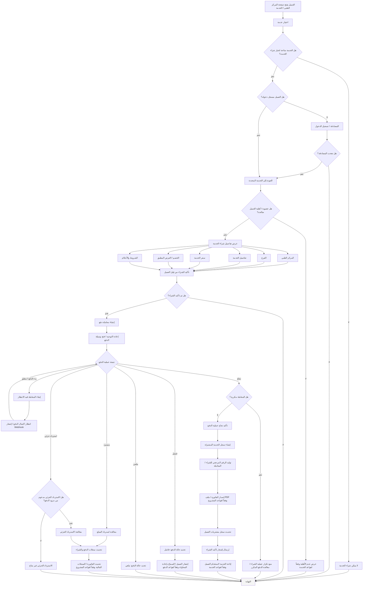

```mermaid
flowchart TD

A[العميل يفتح صفحة المركز الطبي / الخدمة] --> B[اختيار خدمة]

B --> C{هل الخدمة متاحة لخيار شراء الخدمة؟}
C -->|لا| D[لا يمكن شراء الخدمة]
D --> Z[النهاية]

C -->|نعم| E{هل العميل مسجل دخوله؟}

E -->|لا| F[المصادقة / تسجيل الدخول]
F --> G{هل نجحت المصادقة؟}
G -->|لا| Z
G -->|نعم| H[العودة إلى الخدمة المحددة]

E -->|نعم| H

H --> I{هل عضوية / أهلية العميل صالحة؟}
I -->|لا| J[عرض عدم الأهلية وفقاً لقواعد الخدمة]
J --> Z

I -->|نعم| K[عرض تفاصيل شراء الخدمة]

K --> L[المركز الطبي]
K --> M[الفرع]
K --> N[تفاصيل الخدمة]
K --> O[سعر الخدمة]
K --> P[الخصم / العرض المطبق]
K --> Q[الشروط والأحكام]

L --> R[تأكيد الشراء من قِبل العميل]
M --> R
N --> R
O --> R
P --> R
Q --> R

R --> S{هل تم تأكيد الشراء؟}

S -->|لا| Z

S -->|نعم| T[إنشاء معاملة دفع]
T --> U[إعادة التوجيه / فتح وسيلة الدفع]

U --> V{نتيجة عملية الدفع}

V -->|بدء الدفع / معلق| W[إبقاء المعاملة قيد الانتظار]
W --> X[انتظار اكتمال الدفع / إشعار Webhook]
X --> V

V -->|نجاح| Y{هل المعاملة مكررة؟}
Y -->|نعم| Y1[منع تكرار عملية الشراء / معالجة الدفع المكرر]
Y1 --> Z

Y -->|لا| AA[تأكيد نجاح عملية الدفع]
AA --> AB[إنشاء سجل الخدمة المشتراة]
AB --> AC[توليد الرقم المرجعي للشراء / المعاملة]
AC --> AD[إصدار الفاتورة / ملف PDF وفقاً لقواعد المشروع]
AD --> AE[تحديث سجل مشتريات العميل]
AE --> AF[إرسال إشعار تأكيد الشراء]
AF --> AG[إتاحة الخدمة لاستخدام العميل وفقاً لقواعد الخدمة]
AG --> Z

V -->|فشل| AH[تحديد حالة الدفع: فاشل]
AH --> AI[إشعار العميل / السماح بإعادة المحاولة وفقاً لقواعد الدفع]
AI --> Z

V -->|ملغي| AJ[تحديد حالة الدفع: ملغي]
AJ --> Z

V -->|مسترد| AK[معالجة استرداد المبلغ]
AK --> AL[تحديث سجلات الدفع والشراء]
AL --> AM[تحديث الفاتورة / السجلات المالية وفقاً لقواعد المشروع]
AM --> Z

V -->|استرداد جزئي| AN{هل الاسترداد الجزئي مدعوم من مزود الدفع؟}
AN -->|نعم| AO[معالجة الاسترداد الجزئي]
AO --> AL
AN -->|لا| AP[الاسترداد الجزئي غير متاح]
AP --> Z

style Z fill:#f5f5f5
```