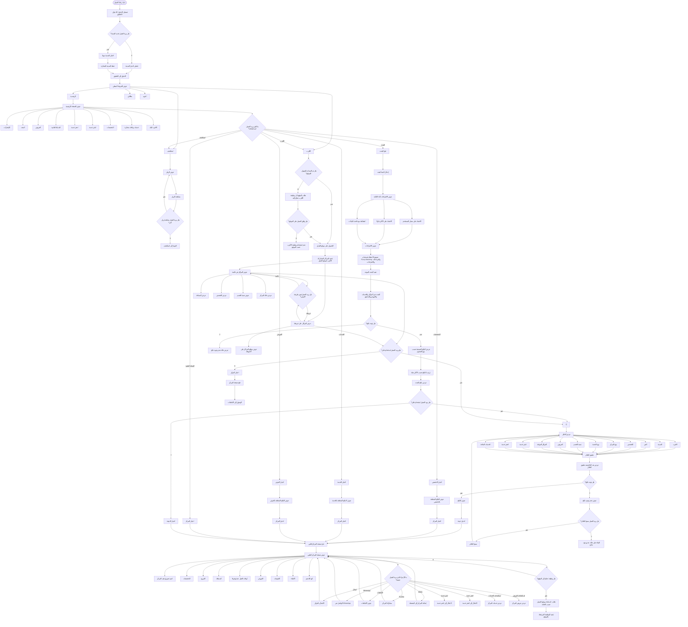

```mermaid
flowchart TD

A([بداية رحلة العميل]) --> B[تسجيل الدخول / الدخول للتطبيق]

B --> C{هل يريد العميل تحديد المدينة؟}

C -->|نعم| D[اختيار المدينة يدويًا]
C -->|لا| E[تخطي اختيار المدينة]

D --> F[حفظ المدينة المختارة]
E --> G[الدخول إلى التطبيق]
F --> G

G --> H[عرض الشريط السفلي]

H --> I[الرئيسية]
H --> J[الأقرب]
H --> K[استكشف]
H --> L[بطاقتي]
H --> M[المزيد]

I --> N[عرض الصفحة الرئيسية]

N --> N1[ الإشعارات]
N --> N2[ البحث]
N --> N3[ العروض]
N --> N4[ الشبكة الطبية]
N --> N5[ احجز خدمة]
N --> N6[ اشتر خدمة]
N --> N7[ التخصصات]
N --> N8[ خدمات وباقات مختارة]
N --> N10[الأقرب اليك ]

N --> O{ما الذي يريد العميل استكشافه؟}

O -->|البحث| P[فتح البحث]
O -->|العروض| T[اختيار العرض]
O -->|الشبكة الطبية| U[اختيار المركز]
O -->|الأقرب| J
O -->|التخصصات| R[اختيار التخصص]
O -->|الخدمات| S[اختيار الخدمة]
O -->|استكشف| K

K --> K1[عرض الريلز]
K1 --> K2[مشاهدة الريل]

K2 --> K3{هل يريد العميل مشاهدة ريل آخر؟}

K3 -->|نعم| K1
K3 -->|لا| K4[العودة إلى استكشف]

P --> P1[إدخال كلمة البحث]

P1 --> P2[عرض الاقتراحات أثناء الكتابة]

P2 --> P3[الاعتماد على سجل المستخدم]
P2 --> P4[الاعتماد على الأكثر تداولًا]
P2 --> P5[المطابقة مع قاعدة البيانات]

P3 --> P6[عرض الاقتراحات]
P4 --> P6
P5 --> P6

P6 --> P7[تصحيح الأخطاء باستخدام Fuzzy Matching والمرادفات والاقتراحات]

P7 --> P8[تنفيذ البحث الموحد]

P8 --> P9[البحث في المراكز والخدمات والعروض والمحتوى]

P9 --> P10{هل توجد نتائج؟}

P10 -->|نعم| P11[عرض النتائج المصنفة حسب نوع المحتوى]
P10 -->|لا| P12[عرض حالة عدم وجود نتائج]

P11 --> P13[ترتيب النتائج حسب الأكثر صلة]

P13 --> P14[عرض نتائج البحث]

P14 --> P15{هل يريد العميل استخدام فلتر؟}

P15 -->|نعم| Q
P15 -->|لا| P16[اختيار النتيجة]

Q --> Q1[عرض الفلاتر]

Q1 --> Q2[الأقرب]
Q1 --> Q3[المدينة]
Q1 --> Q4[الحي]
Q1 --> Q5[التخصص]
Q1 --> Q6[نوع المركز]
Q1 --> Q7[نوع الخدمة]
Q1 --> Q8[نسبة الخصم]
Q1 --> Q9[العروض]
Q1 --> Q10[المراكز الموثقة]
Q1 --> Q11[اشتر خدمة]
Q1 --> Q12[احجز خدمة]
Q1 --> Q13[الخدمات المتاحة]

Q2 --> Q14[تطبيق الفلاتر]
Q3 --> Q14
Q4 --> Q14
Q5 --> Q14
Q6 --> Q14
Q7 --> Q14
Q8 --> Q14
Q9 --> Q14
Q10 --> Q14
Q11 --> Q14
Q12 --> Q14
Q13 --> Q14

Q14 --> Q15[عرض عدد النتائج بعد تطبيق الفلاتر]

Q15 --> Q16{هل توجد نتائج؟}

Q16 -->|نعم| Q17[عرض النتائج]
Q16 -->|لا| Q18[عرض عدم وجود نتائج]

Q17 --> Q19[اختيار نتيجة]
Q19 --> V[فتح صفحة المركز الطبي]

Q18 --> Q20{هل يريد العميل مسح الفلاتر؟}

Q20 -->|نعم| Q21[مسح الفلاتر]
Q21 --> Q1

Q20 -->|لا| Q22[البقاء على حالة عدم وجود نتائج]

J --> J1{هل تم السماح بالوصول للموقع؟}

J1 -->|نعم| J2[الحصول على موقع العميل]
J1 -->|لا| J3[طلب الموقع لأن وظيفة الأقرب تحتاج إليه]

J3 --> J4{هل وافق العميل على الموقع؟}

J4 -->|نعم| J2
J4 -->|لا| J5[عدم استخدام وظيفة الأقرب حسب الموقع]

J2 --> J6[تحديد المراكز المشاركة الأقرب لموقع العميل]

J6 --> J7[عرض المراكز في قائمة]
J6 --> J8[عرض المراكز على خريطة]

J7 --> J9[عرض المسافة]
J7 --> J10[عرض التخصص]
J7 --> J11[عرض نسبة الخصم]
J7 --> J12[عرض حالة المركز]

J8 --> J13[عرض مواقع المراكز على الخريطة]

J7 --> J14{هل يريد العميل تغيير طريقة العرض؟}
J8 --> J14

J14 -->|قائمة| J7
J14 -->|خريطة| J8

J7 --> J15{هل يريد العميل استخدام فلتر؟}
J8 --> J15

J15 -->|نعم| Q
J15 -->|لا| J16[اختيار المركز]

J16 --> J17[فتح صفحة المركز]

J17 --> J18[الوصول إلى الاتجاهات]

R --> R1[عرض النتائج المتعلقة بالتخصص]
R1 --> R2[اختيار المركز]
R2 --> V

S --> S1[عرض النتائج المتعلقة بالخدمة]
S1 --> S2[اختيار المركز]
S2 --> V

T --> T1[عرض النتائج المتعلقة بالعرض]
T1 --> T2[اختيار المركز]
T2 --> V

U --> V

P16 --> V

V --> W[عرض صفحة المركز الطبي]
W --> W2[  اسم /صور/وصف المركز]
W --> W6[ التخصصات]
W --> W7[ الفروع]
W --> W11[ المسافة]
W --> W12[ أوقات العمل عند توفرها]
W --> W13[العروض]
W --> W19[ التقييمات ]
W --> W20[الأطباء ]
W --> W21[كود الخصم ]


W --> X{ما الإجراء الذي يريد العميل تنفيذه؟}

X -->|اتصال| X1[الاتصال بالمركز]
X -->|WhatsApp| X2[التواصل عبر WhatsApp]
X -->|الاتجاهات| X3[عرض الاتجاهات]
X -->|مشاركة| X4[مشاركة المركز]
X -->|مفضلة| X5[إضافة المركز إلى المفضلة]
X -->|اشتر خدمة| X6[الانتقال إلى اشتر خدمة]
X -->|احجز خدمة| X7[الانتقال إلى احجز خدمة]
X -->|استكشاف الخدمات| X9[عرض خدمات المركز]
X -->|استكشاف العروض| X10[عرض عروض المركز]

X1 --> W
X2 --> W
X3 --> W
X4 --> W
X5 --> W

W --> Z{هل وظيفة تحتاج إلى الموقع؟}

Z -->|نعم| ZA[طلب / استخدام موقع العميل حسب الحاجة]
Z -->|لا| W

ZA --> ZB[تنفيذ الوظيفة المرتبطة بالموقع]
```

