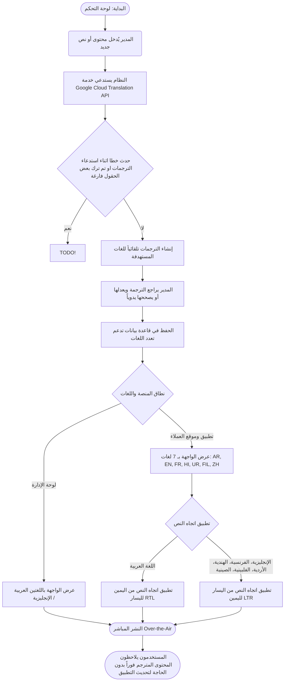

```mermaid
flowchart TD
    A([البداية: لوحة التحكم]) --> B(المدير يُدخل محتوى أو نص جديد)
    
    B --> C[النظام يستدعي خدمة Google Cloud Translation API]
    C --> S{حدث خطا اثناء استدعاء الترجمات او تم ترك بعض الحقول فارغة}
    S -- نعم --> X[TODO!]
    S -- لا --> D[إنشاء الترجمات تلقائياً للغات المستهدفة]
    
    D --> E[المدير يراجع الترجمة ويعدلها أو يصححها يدوياً]
    E --> F[الحفظ في قاعدة بيانات تدعم تعدد اللغات]
    
    F --> G{نطاق المنصة واللغات}
    
    G -- لوحة الإدارة --> H[عرض الواجهة باللغتين العربية / الإنجليزية]
    G -- تطبيق وموقع العملاء --> I[عرض الواجهة بـ 7 لغات: AR, EN, FR, HI, UR, FIL, ZH]
    
    I --> J{تطبيق اتجاه النص}
    
    J -- اللغة العربية --> K[تطبيق اتجاه النص من اليمين لليسار RTL]
    J -- الإنجليزية، الفرنسية، الهندية، الأردية، الفلبينية، الصينية --> L[تطبيق اتجاه النص من اليسار لليمين LTR]
    
    H --> M([النشر المباشر Over-the-Air])
    K --> M
    L --> M
    
    M --> N([المستخدمون يلاحظون المحتوى المترجم فوراً بدون الحاجة لتحديث التطبيق])
```
