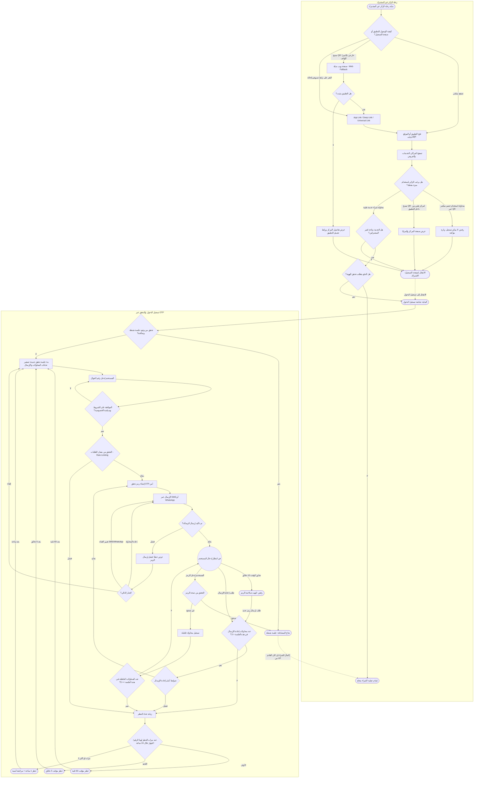

**1. مسارات الوصول والتصفح (رحلة الزائر)**

* **تصفح مباشر:**
بداية رحلة الزائر غير المشترك ⬅ تصفح مباشر ⬅ فتح التطبيق أو الموقع الإلكتروني ⬅ تصفح المراكز، الخدمات، والعروض
* **مسح QR خارجي (التطبيق مثبت):**
بداية رحلة الزائر غير المشترك ⬅ مسح QR خارجي بكاميرا الهاتف ⬅ صفحة ويب بديلة - Web Fallback ⬅ هل التطبيق مثبت؟ (نعم) ⬅ App Link / Deep Link / Universal Link ⬅ فتح التطبيق أو الموقع الإلكتروني ⬅ تصفح المراكز، الخدمات، والعروض
* **مسح QR خارجي (التطبيق غير مثبت):**
بداية رحلة الزائر غير المشترك ⬅ مسح QR خارجي بكاميرا الهاتف ⬅ صفحة ويب بديلة - Web Fallback ⬅ هل التطبيق مثبت؟ (لا) ⬅ عرض تفاصيل المركز ورابط تحميل التطبيق ⬅ الانتقال لصفحة التسجيل/الاشتراك ⬅ الانتقال إلى تسجيل الدخول
* **رابط تسويقي أو إحالة:**
بداية رحلة الزائر غير المشترك ⬅ النقر على رابط تسويقي/إحالة ⬅ App Link / Deep Link / Universal Link ⬅ فتح التطبيق أو الموقع الإلكتروني ⬅ تصفح المراكز، الخدمات، والعروض

---

**2. مسارات التفاعل مع الميزات والشراء**

* **محاولة استخدام خصم مباشر عبر QR:**
تصفح المراكز، الخدمات، والعروض ⬅ محاولة استخدام خصم مباشر عبر QR ⬅ رفض: لا يمكن تسجيل زيارة مؤكدة ⬅ الانتقال لصفحة التسجيل/الاشتراك ⬅ الانتقال إلى تسجيل الدخول
* **مسح QR لمركز طبي من داخل التطبيق:**
تصفح المراكز، الخدمات، والعروض ⬅ مسح QR لمركز طبي من داخل التطبيق ⬅ عرض صفحة المركز والمزايا ⬅ الانتقال لصفحة التسجيل/الاشتراك ⬅ الانتقال إلى تسجيل الدخول
* **محاولة شراء خدمة غير متاحة لغير المشتركين:**
تصفح المراكز، الخدمات، والعروض ⬅ محاولة شراء خدمة طبية ⬅ هل الخدمة متاحة لغير المشتركين؟ (لا) ⬅ الانتقال لصفحة التسجيل/الاشتراك ⬅ الانتقال إلى تسجيل الدخول
* **شراء خدمة متاحة لغير المشتركين (بدون تحقق هوية):**
تصفح المراكز، الخدمات، والعروض ⬅ محاولة شراء خدمة طبية ⬅ هل الخدمة متاحة لغير المشتركين؟ (نعم) ⬅ هل الدفع يتطلب تحقق الهوية؟ (لا) ⬅ إتمام عملية الشراء بنجاح
* **شراء خدمة متاحة لغير المشتركين (تتطلب تحقق هوية):**
تصفح المراكز، الخدمات، والعروض ⬅ محاولة شراء خدمة طبية ⬅ هل الخدمة متاحة لغير المشتركين؟ (نعم) ⬅ هل الدفع يتطلب تحقق الهوية؟ (نعم) ⬅ البداية: شاشة تسجيل الدخول

---

**3. مسارات التحقق وتسجيل الدخول عبر OTP**

* **جلسة نشطة مسبقاً:**
البداية: شاشة تسجيل الدخول ⬅ تحقق من وجود جلسة نشطة وصالحة؟ (نعم) ⬅ نجاح المصادقة: جلسة نشطة
* **جلسة جديدة ورفض الشروط:**
البداية: شاشة تسجيل الدخول ⬅ تحقق من وجود جلسة نشطة وصالحة؟ (لا) ⬅ بدء جلسة تحقق جديدة: تصفير عدادات المحاولات والإرسال ⬅ المستخدم يُدخل رقم الجوال ⬅ الموافقة على الشروط وسياسة الخصوصية؟ (لا) ⬅ المستخدم يُدخل رقم الجوال
* **تجاوز معدل الطلبات (Rate Limiting Fail):**
المستخدم يُدخل رقم الجوال ⬅ الموافقة على الشروط وسياسة الخصوصية؟ (نعم) ⬅ التحقق من معدل الطلبات - Rate Limiting (فشل) ⬅ زيادة عداد الحظر
* **إرسال الرمز بنجاح وإدخاله بشكل صحيح (المسار الناجح):**
الموافقة على الشروط وسياسة الخصوصية؟ (نعم) ⬅ التحقق من معدل الطلبات - Rate Limiting (نجاح) ⬅ إنشاء رمز تحقق OTP آمن ⬅ الإرسال عبر SMS أو WhatsApp ⬅ تم تأكيد إرسال الرسالة؟ (نجاح) ⬅ في انتظار إدخال المستخدم ⬅ المستخدم يُدخل الرمز ⬅ التحقق من صحة الرمز (صحيح) ⬅ نجاح المصادقة: جلسة نشطة

---

**4. مسارات فشل إرسال الرمز**

* **فشل الإرسال ⬅ إعادة المحاولة:**
الإرسال عبر SMS أو WhatsApp ⬅ تم تأكيد إرسال الرسالة؟ (فشل) ⬅ عرض خطأ: فشل إرسال الرمز ⬅ الخيار التالي؟ (إعادة المحاولة) ⬅ الإرسال عبر SMS أو WhatsApp
* **فشل الإرسال ⬅ تغيير القناة:**
الإرسال عبر SMS أو WhatsApp ⬅ تم تأكيد إرسال الرسالة؟ (فشل) ⬅ عرض خطأ: فشل إرسال الرمز ⬅ الخيار التالي؟ (تغيير القناة SMS/WhatsApp) ⬅ الإرسال عبر SMS أو WhatsApp
* **فشل الإرسال ⬅ إلغاء:**
الإرسال عبر SMS أو WhatsApp ⬅ تم تأكيد إرسال الرسالة؟ (فشل) ⬅ عرض خطأ: فشل إرسال الرمز ⬅ الخيار التالي؟ (إلغاء) ⬅ بدء جلسة تحقق جديدة: تصفير عدادات المحاولات والإرسال

---

**5. مسارات الخطأ في إدخال الرمز**

* **إدخال رمز خاطئ (أقل من 5 محاولات):**
في انتظار إدخال المستخدم ⬅ المستخدم يُدخل الرمز ⬅ التحقق من صحة الرمز (غير صحيح) ⬅ تسجيل محاولة فاشلة ⬅ عدد المحاولات الخاطئة في هذه الجلسة >= 5؟ (لا) ⬅ في انتظار إدخال المستخدم
* **إدخال رمز خاطئ (5 محاولات أو أكثر):**
في انتظار إدخال المستخدم ⬅ المستخدم يُدخل الرمز ⬅ التحقق من صحة الرمز (غير صحيح) ⬅ تسجيل محاولة فاشلة ⬅ عدد المحاولات الخاطئة في هذه الجلسة >= 5؟ (نعم) ⬅ زيادة عداد الحظر

---

**6. مسارات إعادة الإرسال وانتهاء الصلاحية**

* **طلب إعادة إرسال ناجح (أقل من 3 محاولات وضوابط ناجحة):**
في انتظار إدخال المستخدم ⬅ طلب إعادة الإرسال ⬅ عدد محاولات إعادة الإرسال في هذه الجلسة < 3؟ (نعم) ⬅ ضوابط أمان إعادة الإرسال (نجاح) ⬅ إنشاء رمز تحقق OTP آمن ⬅ الإرسال عبر SMS أو WhatsApp
* **طلب إعادة إرسال مع فشل ضوابط الأمان:**
في انتظار إدخال المستخدم ⬅ طلب إعادة الإرسال ⬅ عدد محاولات إعادة الإرسال في هذه الجلسة < 3؟ (نعم) ⬅ ضوابط أمان إعادة الإرسال (فشل) ⬅ زيادة عداد الحظر
* **طلب إعادة إرسال وتجاوز الحد (3 محاولات أو أكثر):**
في انتظار إدخال المستخدم ⬅ طلب إعادة الإرسال ⬅ عدد محاولات إعادة الإرسال في هذه الجلسة < 3؟ (لا) ⬅ زيادة عداد الحظر
* **انتهاء مهلة الرمز (10 دقائق) ⬅ طلب رمز جديد ناجح:**
في انتظار إدخال المستخدم ⬅ تجاوز الوقت 10 دقائق ⬅ رفض: انتهت صلاحية الرمز ⬅ طلب إرسال رمز جديد ⬅ عدد محاولات إعادة الإرسال في هذه الجلسة < 3؟ (نعم) ⬅ ضوابط أمان إعادة الإرسال (نجاح) ⬅ إنشاء رمز تحقق OTP آمن
* **انتهاء مهلة الرمز (10 دقائق) ⬅ تجاوز عدد المحاولات:**
في انتظار إدخال المستخدم ⬅ تجاوز الوقت 10 دقائق ⬅ رفض: انتهت صلاحية الرمز ⬅ طلب إرسال رمز جديد ⬅ عدد محاولات إعادة الإرسال في هذه الجلسة < 3؟ (لا) ⬅ زيادة عداد الحظر

---

**7. مسارات الحظر التدريجي (Tiered Blocking)**

* **الحظر للمرة الأولى (60 ثانية):**
زيادة عداد الحظر ⬅ عدد مرات الحظر لهذا الرقم/الجهاز خلال 24 ساعة (الأولى) ⬅ حظر مؤقت 60 ثانية ⬅ بعد 60 ثانية ⬅ بدء جلسة تحقق جديدة: تصفير عدادات المحاولات والإرسال
* **الحظر للمرة الثانية (5 دقائق):**
زيادة عداد الحظر ⬅ عدد مرات الحظر لهذا الرقم/الجهاز خلال 24 ساعة (الثانية) ⬅ حظر مؤقت 5 دقائق ⬅ بعد 5 دقائق ⬅ بدء جلسة تحقق جديدة: تصفير عدادات المحاولات والإرسال
* **الحظر لـ 3 مرات أو أكثر (ساعة ومراجعة):**
زيادة عداد الحظر ⬅ عدد مرات الحظر لهذا الرقم/الجهاز خلال 24 ساعة (3 مرات أو أكثر) ⬅ حظر 1 ساعة + مراجعة أمنية ⬅ بعد ساعة ⬅ بدء جلسة تحقق جديدة: تصفير عدادات المحاولات والإرسال

---

**8. مسار إكمال الشراء بعد التحقق (الربط النهائي)**

* **تحقق الهوية للشراء ⬅ نجاح المصادقة ⬅ إتمام العملية:**
هل الدفع يتطلب تحقق الهوية؟ (نعم) ⬅ شاشة تسجيل الدخول ⬅ نجاح المصادقة: جلسة نشطة ⬅ إكمال الشراء إن كان القادم من VP ⬅ إتمام عملية الشراء بنجاح