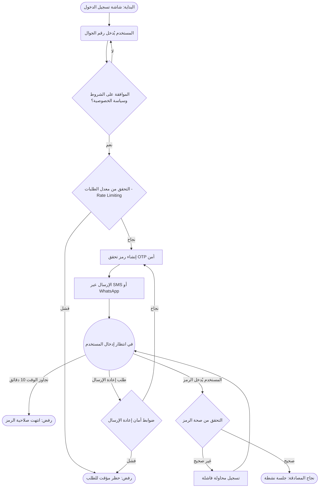

```mermaid
flowchart TD
    A([البداية: شاشة تسجيل الدخول]) --> B(المستخدم يُدخل رقم الجوال)
    B --> C{الموافقة على الشروط وسياسة الخصوصية؟}
    C -- لا --> B
    C -- نعم --> D{التحقق من معدل الطلبات - Rate Limiting}
    
    D -- فشل --> E([رفض: حظر مؤقت للطلب])
    D -- نجاح --> F[إنشاء رمز تحقق OTP آمن]
    
    F --> G[الإرسال عبر SMS أو WhatsApp]
    G --> H((في انتظار إدخال المستخدم))
    
    H -- تجاوز الوقت 10 دقائق --> I([رفض: انتهت صلاحية الرمز])
    
    H -- طلب إعادة الإرسال --> J{ضوابط أمان إعادة الإرسال}
    J -- نجاح --> F
    J -- فشل --> E
    
    H -- المستخدم يُدخل الرمز --> K{التحقق من صحة الرمز}
    K -- غير صحيح --> L[تسجيل محاولة فاشلة]
    L --> H
    
    K -- صحيح --> M([نجاح المصادقة: جلسة نشطة])
```
