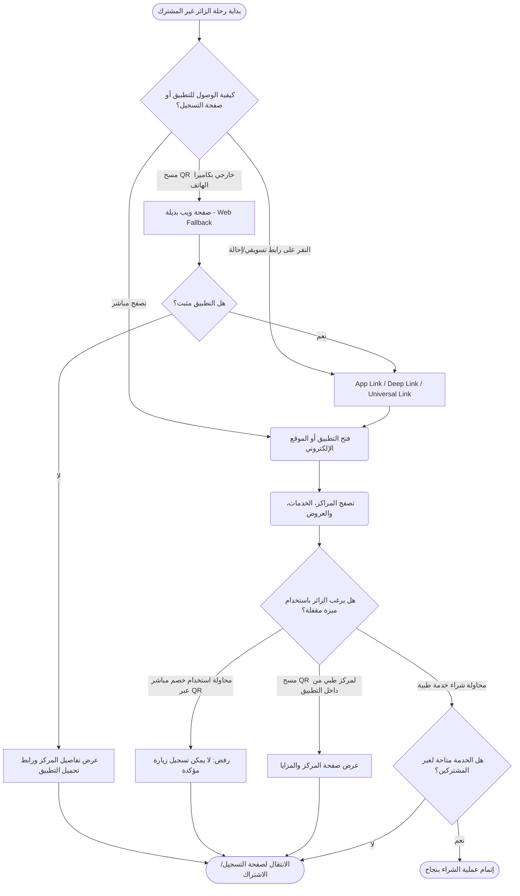

```mermaid
flowchart TD
    A([بداية رحلة الزائر غير المشترك]) --> B{كيفية الوصول للتطبيق أو صفحة التسجيل؟}
    
    B -->|تصفح مباشر| C(فتح التطبيق أو الموقع الإلكتروني)
    B -->|مسح QR خارجي بكاميرا الهاتف| D[صفحة ويب بديلة - Web Fallback]
    B -->|النقر على رابط تسويقي/إحالة| E[App Link / Deep Link / Universal Link]
    
    D --> F{هل التطبيق مثبت؟}
    F -- نعم --> E
    F -- لا --> G[عرض تفاصيل المركز ورابط تحميل التطبيق]
    G --> H([الانتقال لصفحة التسجيل/الاشتراك])
    
    E --> C
    
    C --> I(تصفح المراكز، الخدمات، والعروض)
    I --> J{هل يرغب الزائر باستخدام ميزة مقفلة؟}
    
    J -->|محاولة استخدام خصم مباشر عبر QR| K[رفض: لا يمكن تسجيل زيارة مؤكدة]
    K --> H
    
    J -->|مسح QR لمركز طبي من داخل التطبيق| L[عرض صفحة المركز والمزايا]
    L --> H
    
    J -->|محاولة شراء خدمة طبية| M{هل الخدمة متاحة لغير المشتركين؟}
    M -- نعم --> N([إتمام عملية الشراء بنجاح])
    M -- لا --> H
```
