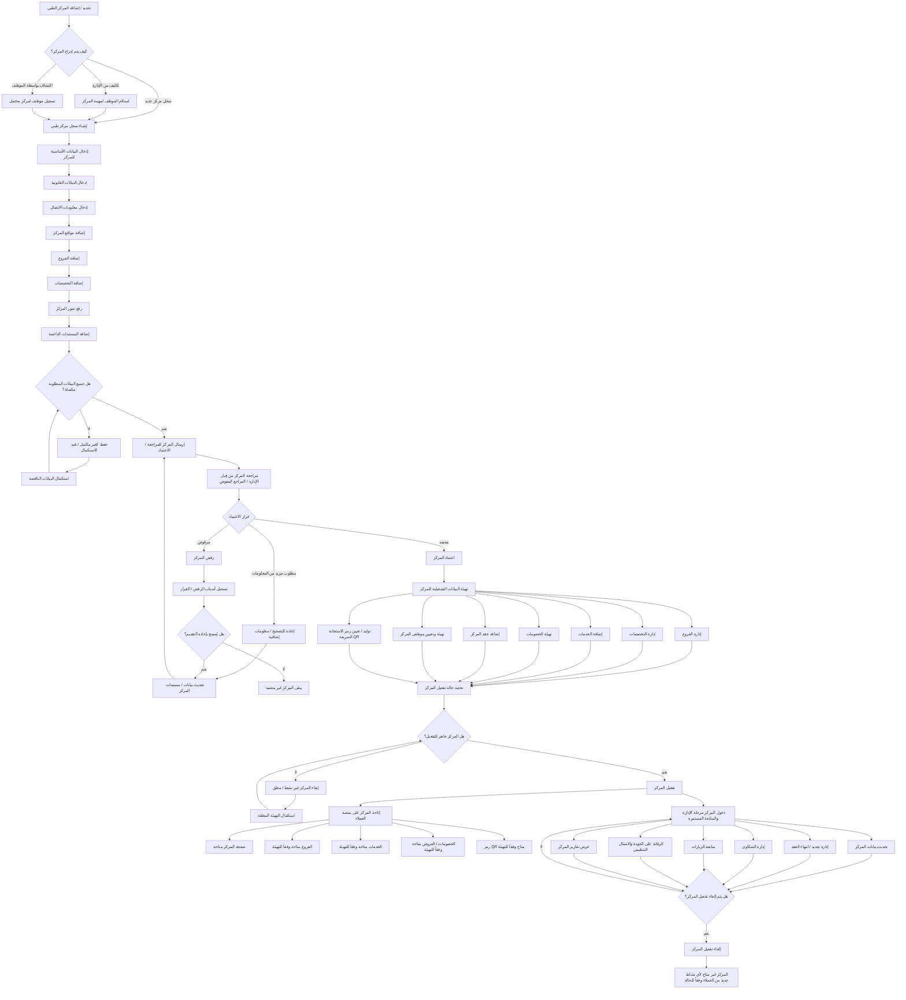

```mermaid
flowchart TD

A[تحديد / إضافة المركز الطبي] --> B{كيف يتم إدراج المركز؟}
B -->|تكليف من الإدارة| C[استلام الموظف لمهمة المركز]
B -->|اكتشاف بواسطة الموظف| D[تسجيل موظف لمركز محتمل]
B -->|سجل مركز جديد| E[إنشاء سجل مركز طبي]

C --> E
D --> E

E --> F[إدخال البيانات الأساسية للمركز]
F --> G[إدخال البيانات القانونية]
G --> H[إدخال معلومات الاتصال]
H --> I[إضافة مواقع المركز]
I --> J[إضافة الفروع]
J --> K[إضافة التخصصات]
K --> L[رفع صور المركز]
L --> M[إضافة المستندات الداعمة]

M --> N{هل جميع البيانات المطلوبة مكتملة؟}

N -->|لا| O[حفظ كغير مكتمل / قيد الاستكمال]
O --> P[استكمال البيانات الناقصة]
P --> N

N -->|نعم| Q[إرسال المركز للمراجعة / الاعتماد]

Q --> R[مراجعة المركز من قِبل الإدارة / المراجع المفوض]

R --> S{قرار الاعتماد}

S -->|معتمد| T[اعتماد المركز]
S -->|مرفوض| U[رفض المركز]
S -->|مطلوب مزيد من المعلومات| V[إعادة للتصحيح / معلومات إضافية]

V --> W[تحديث بيانات / مستندات المركز]
W --> Q

U --> X[تسجيل أسباب الرفض / القرار]
X --> Y{هل يُسمح بإعادة التقديم؟}

Y -->|نعم| W
Y -->|لا| Z[يبقى المركز غير معتمد]

T --> AA[تهيئة البيانات التشغيلية للمركز]

AA --> AB[إدارة الفروع]
AA --> AC[إدارة التخصصات]
AA --> AD[إضافة الخدمات]
AA --> AE[تهيئة الخصومات]
AA --> AF[إضافة عقد المركز]
AA --> AG[تهيئة وتعيين موظفي المركز]
AA --> AH[توليد / تعيين رمز الاستجابة السريعة QR]

AB --> AI[تحديد حالة تفعيل المركز]
AC --> AI
AD --> AI
AE --> AI
AF --> AI
AG --> AI
AH --> AI

AI --> AJ{هل المركز جاهز للتفعيل؟}

AJ -->|لا| AK[إبقاء المركز غير نشط / معلق]
AK --> AL[استكمال التهيئة المعلقة]
AL --> AJ

AJ -->|نعم| AM[تفعيل المركز]

AM --> AN[إتاحة المركز على منصة العملاء]

AN --> AO[صفحة المركز متاحة]
AN --> AP[الفروع متاحة وفقاً للتهيئة]
AN --> AQ[الخدمات متاحة وفقاً للتهيئة]
AN --> AR[الخصومات / العروض متاحة وفقاً للتهيئة]
AN --> AS[رمز QR متاح وفقاً للتهيئة]

AM --> AT[دخول المركز مرحلة الإدارة والمتابعة المستمرة]

AT --> AU[تحديث بيانات المركز]
AT --> AV[إدارة تجديد / انتهاء العقد]
AT --> AW[إدارة الشكاوى]
AT --> AX[متابعة الزيارات]
AT --> AY[الرقابة على الجودة والامتثال التنظيمي]
AT --> AZ[عرض تقارير المركز]

AU --> BA{هل يتم إلغاء تفعيل المركز؟}
AV --> BA
AW --> BA
AX --> BA
AY --> BA
AZ --> BA

BA -->|لا| AT
BA -->|نعم| BB[إلغاء تفعيل المركز]
BB --> BC[المركز غير متاح لأي نشاط جديد من العملاء وفقاً للحالة]
```
