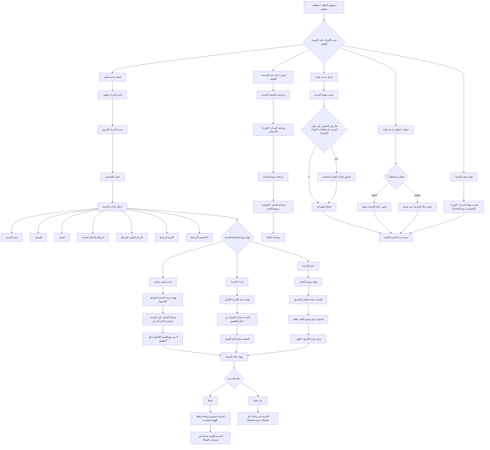

```mermaid
flowchart TD
    A[مسؤول النظام / موظف مفوض] --> B{تحديد الإجراء على الخدمة الطبية}

    B --> C[إنشاء خدمة طبية]
    B --> D[عرض / بحث في الخدمات الطبية]
    B --> E[تعديل خدمة طبية]
    B --> F[تفعيل / تعطيل خدمة طبية]
    B --> G[تهيئة توفر الخدمة]

    C --> H[تحديد المركز الطبي]
    H --> I[تحديد الفرع / الفروع]
    I --> J[تحديد التخصص]
    J --> K[إدخال بيانات الخدمة]

    K --> K1[اسم الخدمة]
    K --> K2[الوصف]
    K --> K3[السعر]
    K --> K4[شروط وأحكام الخدمة]
    K --> K5[المركز الطبي المرتبط]
    K --> K6[الفرع المرتبط]
    K --> K7[التخصص المرتبط]

    K --> L{تهيئة نوع المعاملة للخدمة}

    L --> M[خصم طبي مباشر]
    L --> N[شراء الخدمة]
    L --> O[حجز الخدمة]

    M --> M1[تهيئة نسبة الخصم المطبقة للعضوية]
    M1 --> M2[يحصل العميل على الخدمة مباشرة داخل المركز]
    M2 --> M3[لا يتم دفع القيمة الكاملة داخل التطبيق]

    N --> N1[تهيئة سعر الخدمة الكامل]
    N1 --> N2[الخدمة متاحة للشراء من داخل التطبيق]
    N2 --> N3[العميل يدفع كامل القيمة]

    O --> O1[تهيئة رسوم الحجز]
    O1 --> O2[الخدمة متاحة للحجز المسبق]
    O2 --> O3[العميل يدفع رسوم الحجز فقط]
    O3 --> O4[بدون تحديد التاريخ / الوقت]

    M3 --> P[تهيئة حالة الخدمة]
    N3 --> P
    O4 --> P

    P --> Q{حالة الخدمة}
    Q --> R[نشط]
    Q --> S[غير نشط]

    R --> T[الخدمة منشورة ومتاحة وفقاً للتهيئة المحددة]
    S --> U[الخدمة غير متاحة لأي معاملات جديدة للعملاء]

    D --> V[مراجعة تفاصيل الخدمة]
    V --> W[مراجعة المركز / الفرع / التخصص]
    W --> X[مراجعة نوع المعاملة]
    X --> Y[مراجعة السعر / الخصم / رسوم الحجز]
    Y --> Z[مراجعة الحالة]

    E --> AA[تحديث تهيئة الخدمة]
    AA --> AB{هل يؤثر التعديل على توفر الخدمة أو معاملات العملاء الحالية؟}

    AB -->|لا| AC[حفظ التغييرات]
    AB -->|نعم| AD[تطبيق قواعد العمل المعتمدة]
    AD --> AC

    F --> AE{تفعيل أم تعطيل؟}
    AE -->|تفعيل| AF[تعيين حالة الخدمة: نشط]
    AE -->|تعطيل| AG[تعيين حالة الخدمة: غير نشط]

    G --> AH[تحديث تهيئة المركز / الفرع / التخصص / نوع المعاملة]

    AC --> AI[تم تحديث الخدمة الطبية]
    AF --> AI
    AG --> AI
    AH --> AI
    T --> AJ[الخدمة الطبية متاحة في مسارات العملاء]
```

