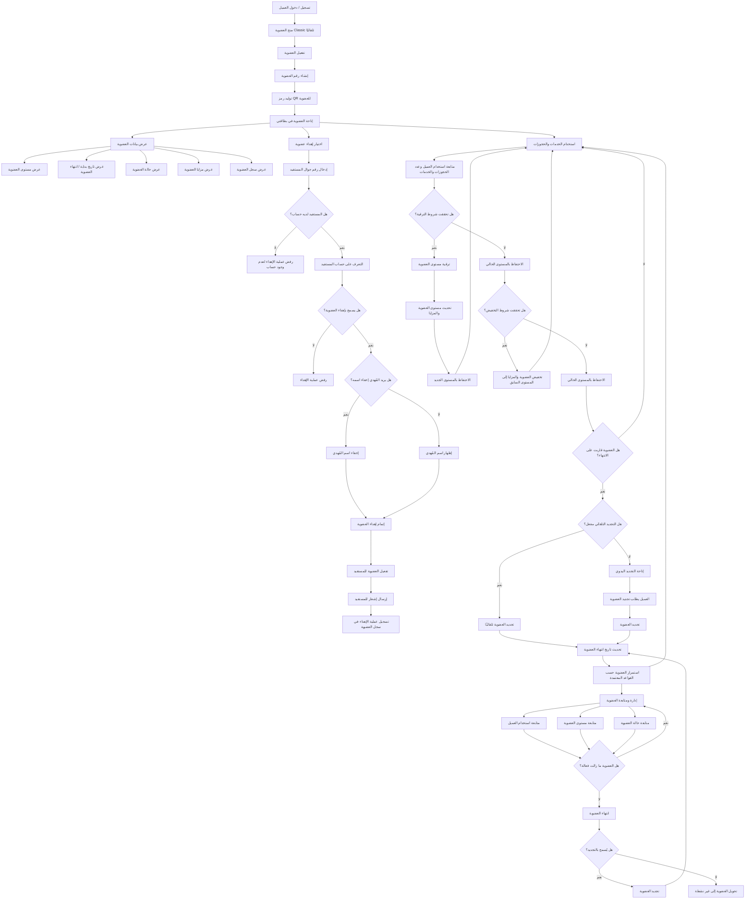

```mermaid
flowchart TD

A[تسجيل / دخول العميل] --> B[منح العضوية Classic تلقائيًا]

B --> C[تفعيل العضوية]

C --> D[إنشاء رقم العضوية]

D --> E[توليد رمز QR للعضوية]

E --> F[إتاحة العضوية في بطاقتي]

F --> G[عرض بيانات العضوية]

G --> H[عرض مستوى العضوية]
G --> I[عرض تاريخ بداية / انتهاء العضوية]
G --> J[عرض حالة العضوية]
G --> K[عرض مزايا العضوية]
G --> L[عرض سجل العضوية]

F --> M[اختيار إهداء عضوية]

M --> N[إدخال رقم جوال المستفيد]

N --> O{هل المستفيد لديه حساب؟}

O -->|لا| P[رفض عملية الإهداء لعدم وجود حساب]

O -->|نعم| Q[التعرف على حساب المستفيد]

Q --> R{هل يسمح بإهداء العضوية؟}

R -->|لا| S[رفض عملية الإهداء]

R -->|نعم| T{هل يريد المُهدي إخفاء اسمه؟}

T -->|نعم| U[إخفاء اسم المُهدي]

T -->|لا| V[إظهار اسم المُهدي]

U --> W[إتمام إهداء العضوية]
V --> W

W --> X[تفعيل العضوية للمستفيد]

X --> Y[إرسال إشعار للمستفيد]

Y --> Z[تسجيل عملية الإهداء في سجل العضوية]

F --> AA[استخدام الخدمات والحجوزات]

AA --> AB[متابعة استخدام العميل وعدد الحجوزات والخدمات]

AB --> AC{هل تحققت شروط الترقية؟}

AC -->|نعم| AD[ترقية مستوى العضوية]

AD --> AE[تحديث مستوى العضوية والمزايا]

AE --> AF[الاحتفاظ بالمستوى الجديد]

AF --> AA

AC -->|لا| AG[الاحتفاظ بالمستوى الحالي]

AG --> AH{هل تحققت شروط التخفيض؟}

AH -->|نعم| AI[تخفيض العضوية والمزايا إلى المستوى السابق]

AI --> AA

AH -->|لا| AJ[الاحتفاظ بالمستوى الحالي]

AJ --> AK{هل العضوية قاربت على الانتهاء؟}

AK -->|لا| AA

AK -->|نعم| AL{هل التجديد التلقائي مفعل؟}

AL -->|نعم| AM[تجديد العضوية تلقائيًا  ]

AM --> AN[تحديث تاريخ انتهاء العضوية]

AL -->|لا| AO[إتاحة التجديد اليدوي]

AO --> AP[العميل يطلب تجديد العضوية]

AP --> AQ[تجديد العضوية  ]

AQ --> AN

AN --> AR[استمرار العضوية حسب القواعد المعتمدة]

AR --> AA

AR --> AS[إدارة ومتابعة العضوية]

AS --> AT[متابعة استخدام العميل]

AS --> AU[متابعة مستوى العضوية]

AS --> AV[متابعة حالة العضوية]

AT --> AW{هل العضوية ما زالت فعالة؟}

AU --> AW

AV --> AW

AW -->|نعم| AS

AW -->|لا| AX[انتهاء العضوية]

AX --> AY{هل يُسمح بالتجديد؟}

AY -->|نعم| AZ[تجديد العضوية ]

AZ --> AN

AY -->|لا| BA[تحويل العضوية إلى غير نشطة]
```

