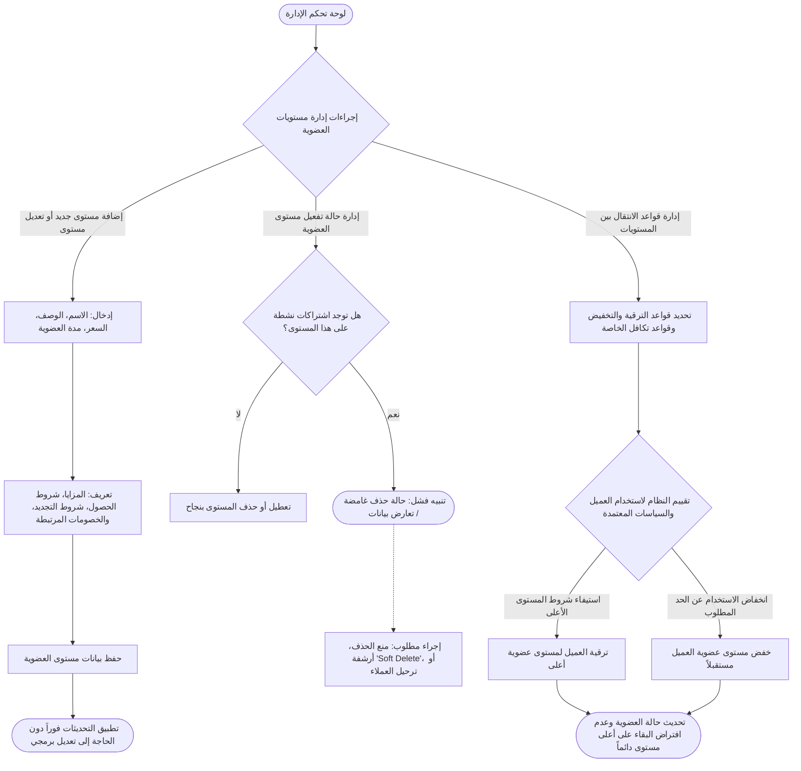

```mermaid
flowchart TD
    A([لوحة تحكم الإدارة]) --> B{إجراءات إدارة مستويات العضوية}
    
    %% مسار الإضافة والتعديل
    B -- إضافة مستوى جديد أو تعديل مستوى --> C[إدخال: الاسم، الوصف، السعر، مدة العضوية]
    C --> D[تعريف: المزايا، شروط الحصول، شروط التجديد، والخصومات المرتبطة]
    D --> E[حفظ بيانات مستوى العضوية]
    E --> F([تطبيق التحديثات فوراً دون الحاجة إلى تعديل برمجي])
    
    %% مسار التفعيل والحذف وحالات الفشل
    B -- إدارة حالة تفعيل مستوى العضوية --> G{هل توجد اشتراكات نشطة على هذا المستوى؟}
    G -- لا --> H[تعطيل أو حذف المستوى بنجاح]
    G -- نعم --> I([تنبيه فشل: حالة حذف غامضة / تعارض بيانات])
    I -.-> J[إجراء مطلوب: منع الحذف، أرشفة 'Soft Delete'، أو ترحيل العملاء]
    
    %% مسار قواعد الترقية والتخفيض
    B -- إدارة قواعد الانتقال بين المستويات --> K[تحديد قواعد الترقية والتخفيض وقواعد تكافل الخاصة]
    K --> L{تقييم النظام لاستخدام العميل والسياسات المعتمدة}
    
    L -- استيفاء شروط المستوى الأعلى --> M[ترقية العميل لمستوى عضوية أعلى]
    L -- انخفاض الاستخدام عن الحد المطلوب --> N[خفض مستوى عضوية العميل مستقبلاً]
    
    M --> O([تحديث حالة العضوية وعدم افتراض البقاء على أعلى مستوى دائماً])
    N --> O
```

