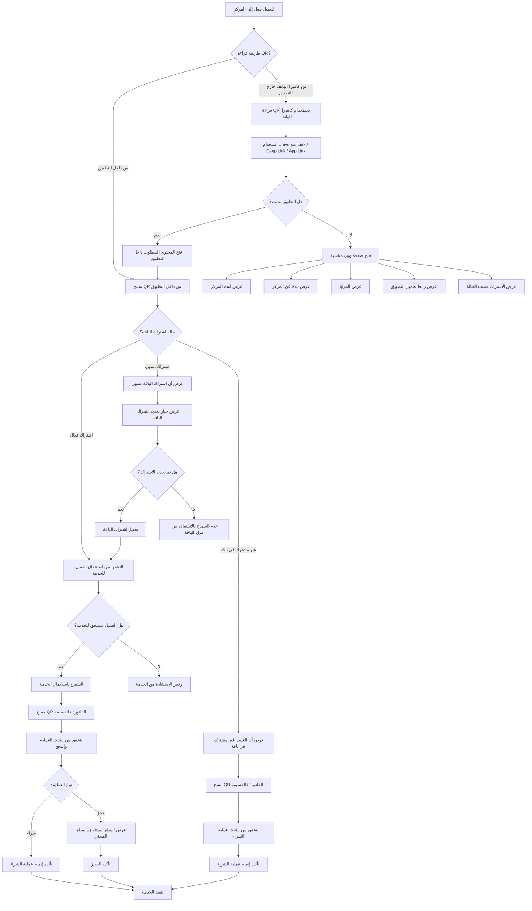

```mermaid
flowchart TD

A[العميل يصل إلى المركز] --> B{طريقة قراءة QR؟}

B -->|من داخل التطبيق| C[مسح QR من داخل التطبيق]
B -->|من كاميرا الهاتف خارج التطبيق| D[قراءة QR باستخدام كاميرا الهاتف]

D --> E[استخدام Universal Link / Deep Link / App Link]

E --> F{هل التطبيق مثبت؟}

F -->|نعم| G[فتح المحتوى المطلوب داخل التطبيق]
G --> C

F -->|لا| H[فتح صفحة ويب مناسبة]

H --> I[عرض اسم المركز]
H --> J[عرض نبذة عن المركز]
H --> K[عرض المزايا]
H --> L[عرض رابط تحميل التطبيق]
H --> M[عرض الاشتراك حسب الحالة]

C --> N{حالة اشتراك الباقة؟}

N -->|اشتراك فعال| O[التحقق من استحقاق العميل للخدمة]

O --> P{هل العميل مستحق للخدمة؟}

P -->|نعم| Q[السماح باستكمال الخدمة]
P -->|لا| R[رفض الاستفادة من الخدمة]

N -->|اشتراك منتهي| S[عرض أن اشتراك الباقة منتهي]
S --> T[عرض خيار تجديد اشتراك الباقة]

T --> U{هل تم تجديد الاشتراك؟}

U -->|نعم| V[تفعيل اشتراك الباقة]
V --> O

U -->|لا| W[عدم السماح بالاستفادة من مزايا الباقة]

N -->|غير مشترك في باقة| X[عرض أن العميل غير مشترك في باقة]
X --> Y[مسح QR الفاتورة / القسيمة]
Y --> Z[التحقق من بيانات عملية الشراء]
Z --> AA[تأكيد إتمام عملية الشراء]
AA --> AB[تنفيذ الخدمة]

Q --> AC[مسح QR الفاتورة / القسيمة]
AC --> AD[التحقق من بيانات العملية والدفع]

AD --> AE{نوع العملية؟}

AE -->|شراء| AF[تأكيد إتمام عملية الشراء]
AE -->|حجز| AG[عرض المبلغ المدفوع والمبلغ المتبقي]

AF --> AB
AG --> AH[تأكيد الحجز]
AH --> AB
```

