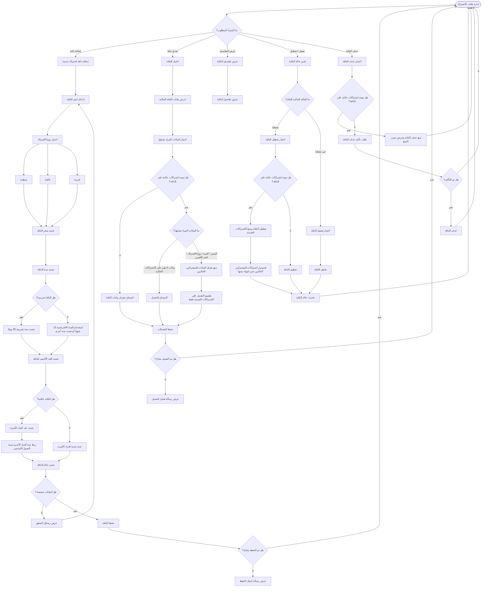

```mermaid
flowchart TD

A([إدارة باقات الاشتراك]) --> B{ما الإجراء المطلوب؟}

B -->|إضافة باقة| C[إضافة باقة اشتراك جديدة]
B -->|تعديل باقة| D[اختيار الباقة]
B -->|عرض التفاصيل| E[عرض تفاصيل الباقة]
B -->|تفعيل / تعطيل| F[تغيير حالة الباقة]
B -->|حذف الباقة| G[اختيار حذف الباقة]


C --> C1[إدخال اسم الباقة]

C1 --> C2[اختيار نوع الاشتراك]

C2 --> C3[منظمة]
C2 --> C4[عائلية]
C2 --> C5[فردية]

C3 --> C6[تحديد سعر الباقة]
C4 --> C6
C5 --> C6

C6 --> C7[تحديد مدة الباقة]

C7 --> C8{هل الباقة تجريبية؟}

C8 -->|نعم| C9[تحديد مدة تجريبية 30 يومًا]
C8 -->|لا| C10[استخدام المدة الافتراضية 12 شهرًا أو تحديد مدة أخرى]

C9 --> C11[تحديد الحد الأقصى للباقة]
C10 --> C11

C11 --> C12{هل الباقة عائلية؟}

C12 -->|نعم| C13[تحديد عدد أفراد الأسرة]
C12 -->|لا| C14[عدم تحديد أفراد الأسرة]

C13 --> C15[ربط مدة أفراد الأسرة بمدة العميل الأساسي]
C14 --> C16[تحديد حالة الباقة]

C15 --> C16

C16 --> C17{هل البيانات صحيحة؟}

C17 -->|لا| C18[عرض رسائل التحقق]
C18 --> C1

C17 -->|نعم| C19[حفظ الباقة]

C19 --> C20{هل تم الحفظ بنجاح؟}

C20 -->|نعم| A
C20 -->|لا| C21[عرض رسالة فشل الحفظ]


D --> D1[عرض بيانات الباقة الحالية]

D1 --> D2[اختيار البيانات المراد تعديلها]

D2 --> D3{هل توجد اشتراكات حالية على الباقة؟}

D3 -->|لا| D4[السماح بتعديل بيانات الباقة]

D3 -->|نعم| D5{ما البيانات المراد تعديلها؟}

D5 -->|بيانات لا تؤثر على الاشتراكات الحالية| D6[السماح بالتعديل]

D5 -->|السعر / المدة / نوع الاشتراك / الحد الأقصى| D7[منع تعديل البيانات للمشتركين الحاليين]

D7 --> D8[تطبيق التعديل على الاشتراكات الجديدة فقط]

D6 --> D9[حفظ التعديلات]
D4 --> D9
D8 --> D9

D9 --> D10{هل تم التعديل بنجاح؟}

D10 -->|نعم| A
D10 -->|لا| D11[عرض رسالة فشل التعديل]


E --> E1[عرض تفاصيل الباقة]


F --> F1{ما الحالة الحالية للباقة؟}

F1 -->|نشطة| F2[اختيار تعطيل الباقة]
F1 -->|غير نشطة| F3[اختيار تفعيل الباقة]

F2 --> F4{هل توجد اشتراكات حالية على الباقة؟}

F4 -->|نعم| F5[تعطيل الباقة ومنع الاشتراكات الجديدة]
F4 -->|لا| F6[تعطيل الباقة]

F5 --> F7[استمرار اشتراكات المشتركين الحاليين حتى انتهاء مدتها]

F6 --> F8[تحديث حالة الباقة]
F7 --> F8

F3 --> F9[تفعيل الباقة]

F9 --> F8
F8 --> A


G --> G1{هل توجد اشتراكات حالية على الباقة؟}

G1 -->|نعم| G2[منع حذف الباقة وعرض سبب المنع]

G1 -->|لا| G3[طلب تأكيد حذف الباقة]

G3 --> G4{هل تم التأكيد؟}

G4 -->|نعم| G5[حذف الباقة]
G4 -->|لا| A

G5 --> A
G2 --> A
```
