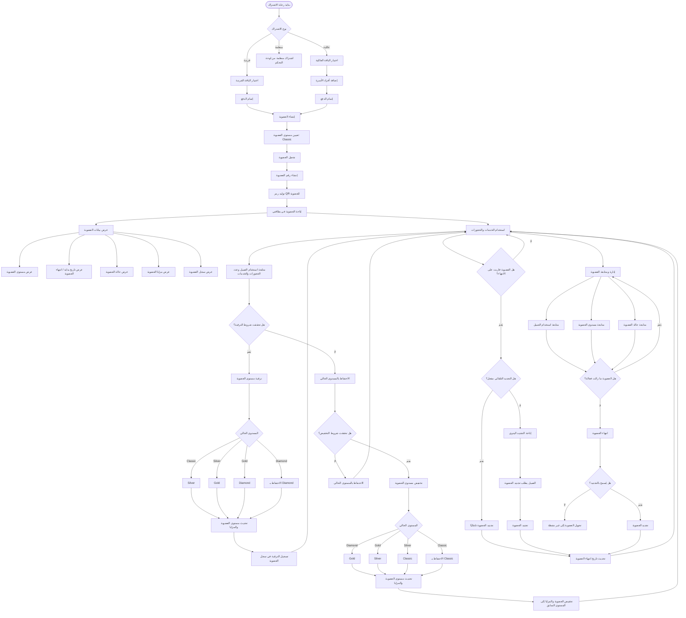

```mermaid
flowchart TD

A([بداية رحلة الاشتراك]) --> B{نوع الاشتراك}

B -->|فردية| C[اختيار الباقة الفردية]
C --> D[إتمام الدفع]

B -->|عائلية| E[اختيار الباقة العائلية]
E --> F[إضافة أفراد الأسرة]
F --> G[إتمام الدفع]

B -->|منظمة| H[اشتراك منظمة من لوحة التحكم]

D --> I[إنشاء العضوية]
G --> I

I --> J[تعيين مستوى العضوية: Classic]
J --> K[تفعيل العضوية]
K --> L[إنشاء رقم العضوية]
L --> M[توليد رمز QR للعضوية]
M --> N[إتاحة العضوية في بطاقتي]

N --> O[عرض بيانات العضوية]

O --> P[عرض مستوى العضوية]
O --> Q[عرض تاريخ بداية / انتهاء العضوية]
O --> R[عرض حالة العضوية]
O --> S[عرض مزايا العضوية]
O --> T[عرض سجل العضوية]

N --> U[استخدام الخدمات والحجوزات]

U --> V[متابعة استخدام العميل وعدد الحجوزات والخدمات]

V --> W{هل تحققت شروط الترقية؟}

W -->|نعم| X[ترقية مستوى العضوية]

X --> Y{المستوى الحالي}

Y -->|Classic| Z[Silver]
Y -->|Silver| AA[Gold]
Y -->|Gold| AB[Diamond]
Y -->|Diamond| AC[الاحتفاظ بـ Diamond]

Z --> AD[تحديث مستوى العضوية والمزايا]
AA --> AD
AB --> AD
AC --> AD

AD --> AE[تسجيل الترقية في سجل العضوية]
AE --> U

W -->|لا| AF[الاحتفاظ بالمستوى الحالي]

AF --> AG{هل تحققت شروط التخفيض؟}

AG -->|نعم| AH[تخفيض مستوى العضوية]

AH --> AI{المستوى الحالي}

AI -->|Diamond| AJ[Gold]
AI -->|Gold| AK[Silver]
AI -->|Silver| AL[Classic]
AI -->|Classic| AM[الاحتفاظ بـ Classic]

AJ --> AN[تحديث مستوى العضوية والمزايا]
AK --> AN
AL --> AN
AM --> AN

AN --> AO[تخفيض العضوية والمزايا إلى المستوى السابق]
AO --> U

AG -->|لا| AP[الاحتفاظ بالمستوى الحالي]
AP --> U

U --> AQ{هل العضوية قاربت على الانتهاء؟}

AQ -->|لا| U

AQ -->|نعم| AR{هل التجديد التلقائي مفعل؟}

AR -->|نعم| AS[تجديد العضوية تلقائيًا]
AS --> AT[تحديث تاريخ انتهاء العضوية]

AR -->|لا| AU[إتاحة التجديد اليدوي]
AU --> AV[العميل يطلب تجديد العضوية]
AV --> AW[تجديد العضوية]
AW --> AT

AT --> U

U --> AX[إدارة ومتابعة العضوية]

AX --> AY[متابعة استخدام العميل]
AX --> AZ[متابعة مستوى العضوية]
AX --> BA[متابعة حالة العضوية]

AY --> BB{هل العضوية ما زالت فعالة؟}
AZ --> BB
BA --> BB

BB -->|نعم| AX
BB -->|لا| BC[انتهاء العضوية]

BC --> BD{هل يُسمح بالتجديد؟}

BD -->|نعم| BE[تجديد العضوية]
BE --> AT

BD -->|لا| BF[تحويل العضوية إلى غير نشطة]
```

