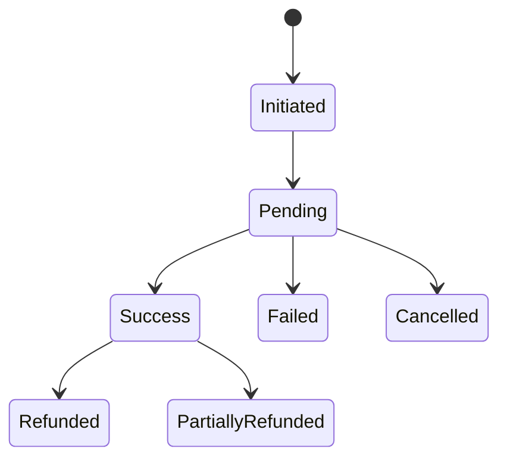

As a **senior system analyst**, my assessment is:

> **This document is a strong functional analysis and a very good starting point for system design, but it is not yet a build-ready specification.**
> 
> We should **not start full development based only on this document**, because many implementation decisions, business rules, state transitions, ownership boundaries, and acceptance criteria are still undefined.

The problem is **not that the document lacks information**. It actually contains a large amount of functional information. The problem is that information is still mostly expressed as **features and fields**, rather than a complete set of **implementable system rules**.

For example, the document successfully says that the system manages medical services, their prices, purchase availability, booking availability, validity periods, and conditions.

But a developer still needs to know exactly:

- When can the service be purchased?
    
- What state does it enter after payment?
    
- What happens when payment succeeds but the database update fails?
    
- Can an expired purchased service be used?
    
- Who marks it as used?
    
- Can it be cancelled?
    
- Can it be refunded?
    
- What happens after partial refund?
    
- Can the center change the service after customers already purchased it?
    

Those are **system rules**, and they are not fully defined merely by listing fields.

---

# 1. The Biggest Flaw: It Is Feature-Oriented, Not Behavior-Oriented

The document is very good at saying:

> "The system contains X."

But development requires defining:

> "When X happens, the system must do Y under condition Z."

For example, QR scanning has many recorded outcomes, including confirmed, membership renewal required, subscription required, location mismatch, QR disabled, and repeated scan.

This is excellent functional information.

However, the document still needs a complete rule set such as:

```text
QR Scan
    ↓
QR Valid?
    ├── No → QR Disabled / Invalid
    └── Yes
         ↓
Membership Exists?
    ├── No → Non-Member Flow
    └── Yes
         ↓
Membership Active?
    ├── No → Renewal Flow
    └── Yes
         ↓
Location Required?
    ├── No → Confirm Visit
    └── Yes
         ↓
Location Valid?
    ├── No → Reject
    └── Yes → Confirm Visit
```

The document contains the **pieces of this workflow**, but not necessarily a single authoritative workflow specification with all decisions and exceptions.

## Why this is dangerous

Different developers may interpret the same requirement differently.

That creates:

- Backend behavior different from mobile behavior.
    
- Admin behavior different from API behavior.
    
- QA testing assumptions different from development assumptions.
    
- Later disputes about whether something is a bug or a change request.
    

---

# 2. No Complete Business Rule Catalogue

The document contains many business rules distributed across multiple sections.

For example:

- Membership levels.
    
- Renewal rules.
    
- QR rules.
    
- Discount rules.
    
- Booking rules.
    
- Service validity.
    
- Payment rules.
    
- Center contracts.
    
- Attribution rules.
    

But there is no central structure like:

```text
BR-001 — Membership Expiration Rule
BR-002 — QR Location Verification Rule
BR-003 — Repeated QR Scan Prevention Rule
BR-004 — Service Purchase Validity Rule
BR-005 — Booking Expiration Rule
BR-006 — Non-Member Purchase Eligibility Rule
BR-007 — Discount Priority Rule
```

This is a major missing artifact.

For example, the document says discounts may be associated with centers, services, service types, branches, and membership levels.

But it does not fully define:

## Which discount wins?

Example:

```text
Customer:
Gold Membership

Service:
Original Price = 500

Discount A:
Gold Membership = 20%

Discount B:
Service Discount = 30%

Offer C:
Temporary Price = 300
```

What does the customer pay?

- 350?
    
- 300?
    
- 280?
    
- 210?
    
- Lowest available price?
    
- Highest priority rule?
    
- Can discounts stack?
    

Without this, the pricing engine cannot be safely implemented.

---

# 3. State Machines Are Missing or Incomplete

This is probably one of the most important missing areas.

The document mentions many states.

For example, payment states include:

- Initiated.
    
- Pending.
    
- Success.
    
- Failed.
    
- Cancelled.
    
- Refunded.
    
- Partial Refund.
    

But listing states is **not enough**.

We need:



And, more importantly:

### Allowed transitions

|From|To|Allowed?|Trigger|
|---|---|---|---|
|Initiated|Pending|Yes|Payment provider|
|Pending|Success|Yes|Webhook|
|Pending|Failed|Yes|Provider|
|Success|Failed|No|Not allowed|
|Refunded|Success|No|Not allowed|

The same issue applies to:

- Membership.
    
- QR.
    
- Medical center.
    
- Branch.
    
- Service.
    
- Purchased service.
    
- Reserved service.
    
- Complaint.
    
- Contract.
    
- Offer.
    
- Coupon.
    
- Notification.
    
- Payment.
    
- Settlement.
    

The current document has states, but **not a complete state transition model**.

---

# 4. Actor Ownership Is Still Not Fully Defined

The document describes many entities and employee types.

For example, center employees can be linked to centers and assigned roles and permissions.

But development needs a complete actor model.

For every action, we need:

```text
WHO performs the action?
WHO owns the data?
WHO approves the action?
WHO can override it?
WHO is notified?
WHO can reverse it?
```

Example:

### Center Discount

Who can:

- Create?
    
- Edit?
    
- Submit?
    
- Approve?
    
- Reject?
    
- Activate?
    
- Deactivate?
    
- Delete?
    

The answer cannot simply be:

> "Admin manages discounts."

Because the actual system may involve:

```text
Center Employee
    ↓ submits

Takafol Employee
    ↓ reviews

Manager
    ↓ approves

System
    ↓ activates
```

Those workflows must be explicit.

---

# 5. Approval Workflows Are Missing

The document has many concepts that clearly require approval.

Examples:

- Medical center approval.
    
- Center documents.
    
- Non-member service access.
    
- Discounts.
    
- Offers.
    
- Contracts.
    
- Refunds.
    
- Employee accounts.
    
- Financial settlements.
    

But a consistent approval engine/workflow is not formally defined.

For example:

```text
Draft
↓
Submitted
↓
Under Review
├── Rejected
│    ↓
│ Corrected
│    ↓
│ Submitted
│
└── Approved
     ↓
     Active
```

Without defining approval lifecycles, developers will build isolated approval logic for every module.

That creates duplicated and inconsistent workflows.

---

# 6. The Data Model Is Not Yet a Data Model

The document contains a large number of fields.

That is valuable.

But a field list is not an ERD.

For example:

```text
Customer
Membership
Membership Level
Membership Renewal
Payment
Purchased Service
Reserved Service
Medical Center
Branch
Discount
Offer
Contract
QR
Visit
Complaint
Campaign
Coupon
Settlement
```

We still need to define:

### Relationships

```text
Customer 1 --- * Membership
Membership * --- 1 Membership Level

Medical Center 1 --- * Branch
Medical Center 1 --- * Center Service

Center Service 1 --- * Purchase
Center Service 1 --- * Reservation

QR 1 --- * QR Scan
QR Scan 0..1 --- 1 Confirmed Visit
```

The document already contains relationship clues, such as services belonging to centers and having original prices, platform prices, purchase settings, reservation settings, and validity periods.

But these still need to become an authoritative conceptual/logical data model.

---

# 7. No Clear Source of Truth for Pricing

This is a critical risk.

The system includes:

- Original price.
    
- Platform price.
    
- Discounts.
    
- Membership discounts.
    
- Temporary offers.
    
- Coupons.
    
- Campaign codes.
    
- Booking fees.
    
- Payment fees.
    
- Commissions.
    
- Center share.
    
- Platform revenue.
    

Financial information for operations and settlements includes multiple amounts such as gateway fees, discounts, commissions, refunds, platform revenue, center share, and net amount.

But there is no complete **Pricing and Financial Calculation Specification**.

We need to define:

```text
Original Price
        ↓
Applicable Discount Rules
        ↓
Final Service Price
        ↓
Coupon?
        ↓
Final Payable Amount
        ↓
Gateway Fees
        ↓
Platform Revenue
        ↓
Center Settlement Amount
```

Otherwise different modules may calculate money differently.

This is one of the highest-risk areas of the entire system.

---

# 8. Refund Rules Are Not Fully Defined

The document supports refunds and partial refunds.

But it does not yet fully answer:

- Who can request a refund?
    
- Who can approve it?
    
- Can customers cancel before service usage?
    
- Can an expired service be refunded?
    
- Can booking fees be refunded?
    
- Is partial usage refundable?
    
- What happens to the purchased service after refund?
    
- What happens to the invoice?
    
- What happens to the center settlement?
    

Example:

```text
Payment = Success
Purchase = Active

Refund Requested
    ↓
Under Review
    ↓
Approved
    ↓
Refund Processed
    ↓
Purchase Invalidated
    ↓
Settlement Adjusted
```

Without this, the payment module is incomplete.

---

# 9. Exception and Failure Scenarios Are Insufficient

The document mostly describes the successful flow.

But production systems are mostly complicated by failures.

Examples missing or needing formal definition:

### Payment

```text
Payment succeeded at gateway
BUT
Webhook never arrives.
```

### QR

```text
QR scan succeeds
BUT
Internet disconnects before visit confirmation.
```

### Location

```text
GPS permission granted
BUT
Location accuracy is 5 km.
```

### Membership

```text
Membership expires during checkout.
```

### Purchase

```text
Customer presses Pay twice.
```

### Notification

```text
Push notification fails.
SMS succeeds.
WhatsApp fails.
```

These need explicit expected behavior.

---

# 10. Location Rules Are Not Technically Precise Enough

The document includes location verification and proximity features.

But the implementation needs definitions such as:

```text
Allowed Radius = 200 meters?
GPS Accuracy Maximum = 100 meters?
Minimum Accuracy = 50 meters?
Location Age Maximum = 30 seconds?
Mock Location Detection Required?
```

Otherwise "near the center" is subjective.

A developer cannot implement a reliable geolocation verification engine based on:

> "Check whether the customer is near the center."

We need measurable rules.

---

# 11. QR Anti-Fraud Rules Are Still Too High-Level

The document correctly identifies repeated scans and suspicious activity.

But "repeated scan" needs an actual rule.

Example:

```text
Maximum confirmed visit:
1 per center every 24 hours
```

Or:

```text
Maximum:
3 scans in 10 minutes
```

Or perhaps different rules depending on membership or center.

We also need:

- Device fingerprint policy.
    
- Session rules.
    
- Location spoofing policy.
    
- QR token rotation.
    
- QR expiration.
    
- Screenshot protection expectations.
    
- Replay attack prevention.
    

The current requirements provide outcomes but not enough operational parameters.

---

# 12. No Complete API Contract

Development cannot safely begin backend and frontend independently without defining interfaces.

We need contracts such as:

```text
POST /auth/login
POST /auth/verify-otp

GET /centers
GET /centers/{id}

POST /qr/scan

POST /services/{id}/purchase

POST /payments/initiate
POST /payments/webhook
```

Each API should define:

- Request.
    
- Response.
    
- Validation.
    
- Authentication.
    
- Error codes.
    
- Permissions.
    
- Idempotency.
    
- Rate limits.
    

Without this, frontend and backend teams will make assumptions.

---

# 13. Error Handling Is Not Defined as a Product Behavior

The document says security and error handling should exist, but does not define user-facing error behavior.

We need standards like:

```text
AUTH_INVALID_OTP
AUTH_OTP_EXPIRED
MEMBERSHIP_EXPIRED
QR_DISABLED
QR_LOCATION_MISMATCH
PAYMENT_PENDING
PAYMENT_FAILED
SERVICE_EXPIRED
```

Then define:

- HTTP/API response.
    
- User-facing message.
    
- Retry behavior.
    
- Logging behavior.
    

---

# 14. Acceptance Criteria Are Missing at Requirement Level

This is a major reason not to start development yet.

Example:

### Current Requirement

> Customer can purchase a service.

### Build-Ready Acceptance Criteria

```text
Given an active customer
And an eligible service
When the customer completes a successful payment
Then a purchase record is created
And a unique reference number is generated
And the service is visible in My Purchases
And an invoice is generated
And the service validity period starts
```

Without acceptance criteria:

> "Implemented" becomes subjective.

QA cannot objectively decide whether the requirement is complete.

---

# 15. Requirements Are Not Fully Traceable to Tests

The document is detailed, but a complete matrix is still required:

|Requirement|Module|Actor|Workflow|API|UI|Test Cases|
|---|---|---|---|---|---|---|

For example:

```text
REQ
 ↓
Module
 ↓
Actor
 ↓
Use Case
 ↓
Business Rule
 ↓
Acceptance Criteria
 ↓
Test Cases
```

Without this, some requirements will inevitably be lost during implementation.

---

# 16. No Use Case Model

The actor work you started is extremely important because the document still needs a complete interaction model.

We need:

```text
Customer
Non-Member Visitor
Medical Center
Center Employee
Receptionist
Center Accountant
Admin
Finance Employee
Sales Employee
Marketing Employee
Quality Employee
System
Payment Gateway
Notification Provider
Maps Provider
```

Then each actor needs:

- Responsibilities.
    
- Permissions.
    
- Actions.
    
- Inputs.
    
- Outputs.
    
- Related workflows.
    

The current document contains many actor-related details but does not yet consolidate them into an actor model.

---

# 17. Non-Functional Requirements Are Too General

Statements such as:

- Fast.
    
- Scalable.
    
- Secure.
    
- Stable.
    

are not measurable.

We need:

### Performance

```text
95% of API requests < 500 ms
```

### Availability

```text
99.9% uptime
```

### QR

```text
QR validation response < 2 seconds
```

### Search

```text
Results returned < 1 second
```

### Scalability

```text
Support X concurrent users
```

Without measurable targets, QA cannot verify quality.

---

# 18. Notification Rules Need More Precision

The document supports multiple channels and notification targeting.

But still needs:

- Priority.
    
- Channel fallback.
    
- Retry policy.
    
- Deduplication.
    
- Quiet hours.
    
- Delivery failure behavior.
    
- Provider failure behavior.
    

Example:

```text
Push fails
↓
Retry 3 times
↓
If critical → fallback to SMS
```

Without this, every notification type may behave differently.

---

# 19. Multi-Language Rules Need a Complete Localization Model

Supporting seven languages is much more than translating UI labels.

Need to define:

- Translation ownership.
    
- Fallback language.
    
- Missing translation behavior.
    
- Dynamic content translation.
    
- Center content languages.
    
- Search across languages.
    
- Arabic/English mixed search.
    
- Numbers and currency.
    
- Date formats.
    
- RTL behavior.
    

Otherwise multilingual implementation becomes inconsistent.

---

# 20. The Document Needs a Formal Glossary

Terms can easily be confused.

For example:

- Service.
    
- Center Service.
    
- Purchase.
    
- Reservation.
    
- Booking.
    
- Visit.
    
- QR Scan.
    
- Confirmed Visit.
    
- Platform Price.
    
- Special Price.
    
- Discount.
    
- Offer.
    
- Coupon.
    

A glossary should formally define every business term.

Example:

```text
Purchase:
A transaction where the customer pays the full service amount inside Takafol.

Reservation:
A transaction where the customer pays only a reservation fee and pays the remaining service amount at the medical center.

Visit:
A confirmed QR-based benefit utilization event.
```

This prevents different teams from implementing different interpretations.

---

# 21. The Document Contains Some Areas That Need Conflict Resolution

Because the system has grown organically, some rules appear to need consolidation.

For example, QR management contains concepts around:

- Unified codes.
    
- Center codes.
    
- Branch-specific codes.
    

The document itself reflects these alternatives.

This must become one final decision:

```text
QR ownership =
Center / Branch / Both

Number of active QR codes =
One / Multiple

QR rotation =
Yes / No

QR reuse =
Allowed / Not Allowed
```

Until these questions are resolved, database and QR architecture should not be finalized.

---

# 22. What This Document Actually Is

In my opinion, this document is currently best described as:

> **Functional Requirements + Functional Analysis Draft**

It is **not yet a complete System Specification**.

The progression should be:

```text
Current Functional Analysis
        ↓
Requirement Modules
        ↓
Actors
        ↓
Business Rules
        ↓
Use Cases / Workflows
        ↓
State Machines
        ↓
Domain Model / ERD
        ↓
Open Questions Resolution
        ↓
Acceptance Criteria
        ↓
API Contracts
        ↓
Architecture
        ↓
UI/UX Specification
        ↓
Test Cases
        ↓
Development
```

---

# My Senior Analyst Verdict

## Can we use this document to start analysis and system design?

**Yes — absolutely.**

It is actually a strong foundation for that.

## Can we use it to start UI/UX exploration?

**Yes.**

With some open questions documented.

## Can we use it to start database conceptual design?

**Yes, at a high level.**

But not finalize it yet.

## Can we use it to start full backend implementation?

**No.**

Not safely.

## Can we use it as the only source for starting the entire project?

**No.**

Because we still need to convert the functional requirements into **implementable specifications**.

---

# The Most Important Missing Deliverables Before Full Development

I would require these before saying:

> **"The system is ready for development."**

1. **Final Module Structure**
    
2. **Actor Catalogue**
    
3. **Business Rule Catalogue**
    
4. **Complete Workflow / Use Case Diagrams**
    
5. **State Transition Definitions**
    
6. **Open Questions Resolution**
    
7. **Conceptual ERD**
    
8. **Logical Data Model**
    
9. **Pricing & Financial Rules**
    
10. **Approval Workflow Definitions**
    
11. **Acceptance Criteria**
    
12. **API Contracts**
    
13. **Error & Exception Catalogue**
    
14. **Measurable Non-Functional Requirements**
    
15. **Permissions Matrix**
    
16. **Integration Specifications**
    

### The key point

**The document tells us what the business wants to have.**

But before development, we must also define:

> **exactly how the system behaves when users, data, rules, states, integrations, and failures interact with each other.**

That conversion is exactly why the modularization process, actors, open questions, acceptance criteria, workflows, and class/domain diagrams you are building are necessary. They transform this from a **feature document** into a **system specification that a development and QA team can reliably build and verify**.